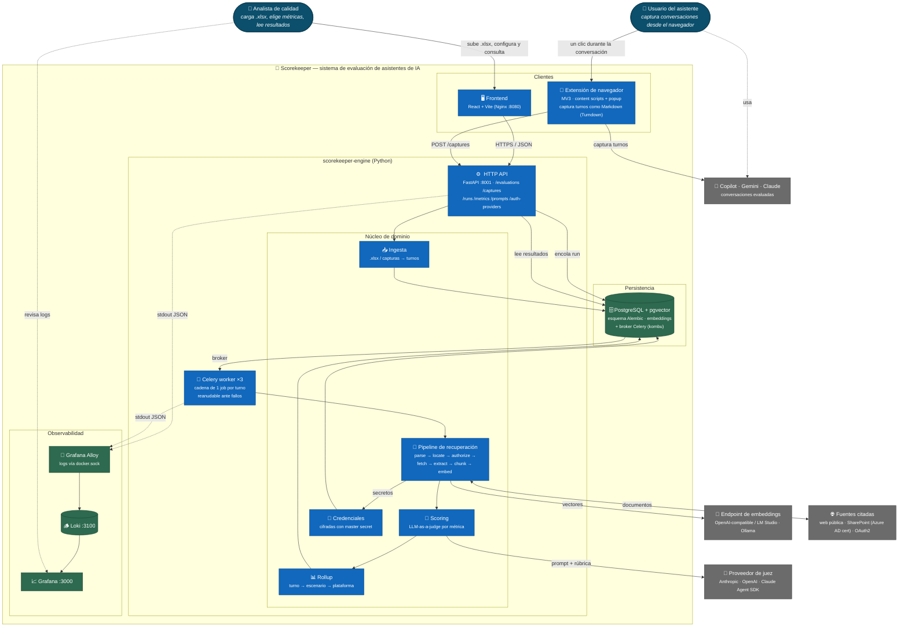

# Scorekeeper

## Qué es

Scorekeeper es un sistema que evalúa automáticamente la calidad de las conversaciones que las personas mantienen con asistentes de inteligencia artificial como Copilot, Gemini y Claude. En lugar de que alguien revise manualmente cientos de conversaciones para juzgar qué tan buenas son las respuestas, el sistema usa otra inteligencia artificial como "juez" que lee cada intercambio y le asigna una calificación, de forma parecida a como un evaluador humano calificaría un examen, pero de manera automática, consistente y a gran escala.

## Qué hace

- **Reúne las conversaciones**: se cargan desde un archivo Excel o se capturan con un clic desde una extensión de navegador mientras se usa el asistente, sin exportar ni subir nada manualmente.
- **Organiza el contenido**: convierte cada archivo o captura en una secuencia clara de preguntas y respuestas, identificando quién dijo qué, sin importar el formato o idioma del archivo original.
- **Permite decidir qué revisar**: antes de calificar, se elige qué preguntas y respuestas evaluar y bajo qué criterios de calidad.
- **Verifica las fuentes citadas**: cuando una respuesta menciona un documento o página web como respaldo, el sistema lo descarga y revisa si la respuesta realmente se apoya en esa información o la contradice.
- **Califica cada respuesta**: evalúa si contesta lo preguntado, si usa bien la información disponible y si no inventa datos, dejando siempre una breve justificación de la nota.
- **Calcula promedios en cascada**: combina las notas de cada intercambio en un puntaje por conversación, y estos en un puntaje por plataforma, permitiendo comparar Copilot, Gemini y Claude entre sí.
- **Permite seguimiento en tiempo real**: se puede consultar el avance de una evaluación, revisar el detalle de cada conversación calificada y entender por qué se otorgó cada nota, incluyendo el costo de IA que tomó evaluarla.
- **Es resistente a fallos**: si el proceso se interrumpe, retoma el trabajo justo donde quedó, sin repetir tareas ya hechas ni gastar de más.
- **Protege el acceso a información sensible**: guarda de forma segura las credenciales para consultar fuentes protegidas, y mantiene un historial de versiones de las instrucciones que usa el juez de IA, para que los resultados sean comparables entre sí.

## Propuesta de valor

Scorekeeper permite a una organización responder, con evidencia y no solo con impresiones, qué asistente de IA funciona mejor. Reemplaza la revisión manual —lenta, costosa y subjetiva— por un proceso automático, consistente y auditable, donde cada calificación puede rastrearse hasta su justificación. Esto permite decidir qué plataforma adoptar o mantener, detectar rápidamente respuestas de baja calidad o mal fundamentadas, y controlar el costo del proceso de evaluación. Al capturar conversaciones directamente desde el navegador y procesar grandes volúmenes sin intervención humana, reduce el esfuerzo operativo y acelera la mejora continua de los asistentes de IA usados por la organización.

## Arquitectura



## Run everything with Docker

```bash
docker compose up --build
```

The services are then available at:

- HTTP API: `http://localhost:8001`
- Frontend: `http://localhost:8080`
- PostgreSQL: `localhost:5432`

## Run the API locally

The Python engine lives in `scorekeeper-engine/` and owns its own `pyproject.toml`,
lockfile and Alembic config, so every `uv`, `pytest`, `ruff` and `alembic` command below
runs from that directory:

```bash
cd scorekeeper-engine
```

Install dependencies:

```bash
uv sync --extra dev
```

Run the HTTP API (uvicorn on `API_HOST`/`API_PORT`, `0.0.0.0:8001` by default):

```bash
uv run scorekeeper-api
```

Ingestion (`POST /evaluations`, `POST /captures`) only enqueues work — retrieval and
scoring run in a Celery worker, so start one too or runs stay in `en_cola`:

```bash
uv run celery -A scorekeeper.celery_app:celery_app worker --loglevel=info
```

Without a `DATABASE_URL`, local commands use `scorekeeper.db` through SQLite. Copy
`scorekeeper-engine/.env.example` to `scorekeeper-engine/.env` to use the Compose
PostgreSQL instance from the host.

### Judge providers

Scoring uses an LLM-as-a-judge selected by `JUDGE_PROVIDER` (`anthropic`, `openai`,
or `agent`); install the SDKs with `uv sync --extra judges`. For end-to-end testing
with no API key to configure, set `JUDGE_PROVIDER=agent`: that judge runs every call
through the Claude Code CLI bundled with
[claude-agent-sdk](https://github.com/anthropics/claude-agent-sdk-python) and
authenticates with the local Claude Code session (log in once with `claude`). It
calls the same Claude models as the Anthropic judge — `AGENT_JUDGE_MODEL` must name
one of them — with the built-in tools disabled, so each call is a plain rubric
evaluation.

Under Docker the container has no Claude Code session to authenticate with, so set
`CLAUDE_CODE_OAUTH_TOKEN` in `scorekeeper-engine/.env` (generate one with `claude
setup-token`); the judge forwards it to the CLI it spawns. Compose already passes the
whole `.env` to `api`, `worker` and `migrate`, so no extra wiring is needed.

`answer_relevance` still needs embeddings, which run through an
OpenAI-compatible endpoint (`OPENAI_API_KEY`); set `OPENAI_BASE_URL` to point them at a
local server (LM Studio, Ollama, vLLM) and the run stays entirely local. See
`scorekeeper-engine/.env.example` for all knobs.

### Reading results

`GET /runs` returns full scored details for the runs matching a set of filters
(`run_id`, `platform`, a `start_date`/`end_date` scoring-window range), at a chosen
`granularity` (`platform_executions`, `scenario_results`, or `metric_scores`). See
[docs/apis.md](docs/apis.md) for every endpoint.

## Database migrations

The schema is owned by [Alembic](https://alembic.sqlalchemy.org/), not by the
application — the services no longer create tables on startup. Under Docker, the
one-shot `migrate` service runs `alembic upgrade head` before `api` and `worker`
start, so the schema is always current.

Run migrations manually against the database named by `DATABASE_URL`:

```bash
uv run alembic upgrade head      # apply all pending migrations
uv run alembic downgrade -1      # roll back the most recent migration
uv run alembic current           # show the applied revision
```

After changing the models in `scorekeeper-engine/src/scorekeeper/db/models.py`, autogenerate a new
migration and apply it:

```bash
uv run alembic revision --autogenerate -m "describe the change"
uv run alembic upgrade head
```

Autogenerate compares the models against a live database, so point
`DATABASE_URL` at PostgreSQL when generating migrations to render native types
(`JSONB`, `uuid`) correctly. Always review the generated script before committing.

## Develop the frontend

```bash
cd frontend
npm install
npm run dev
```

Vite runs at `http://localhost:5173` and reads `VITE_API_URL` when provided.

## Browser extension

`extension/` is a Manifest V3 Chrome extension that captures the conversation open
in Copilot, Gemini, Claude or ChatGPT and posts it to `POST /captures` — the live-session
alternative to uploading a conversation `.xlsx`. No build step: load the folder
unpacked from `chrome://extensions` with **Developer mode** on. See
[extension/README.md](extension/README.md) for the adapters it supports and how to
update their selectors when a vendor reskins its chat.

## Checks

```bash
cd scorekeeper-engine && uv run pytest
cd scorekeeper-engine && uv run ruff check .
cd frontend && npm run build
```

