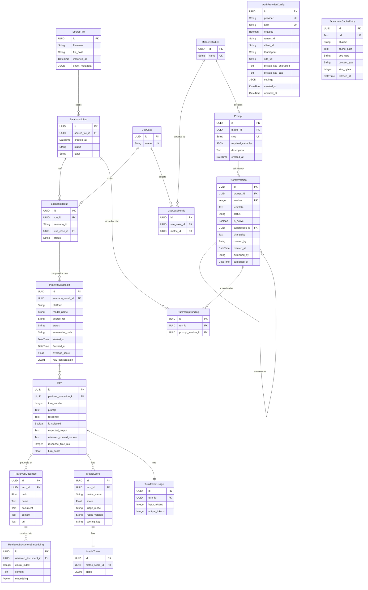
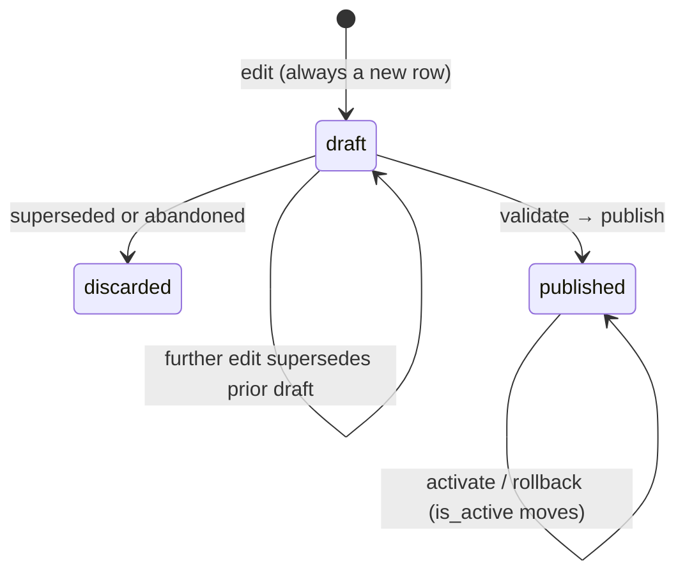

# Data model

Scorekeeper stores benchmark results as a hierarchy. The SQLAlchemy models live
in `scorekeeper-engine/src/scorekeeper/db/models.py`, and the schema is managed with Alembic (see the
"Database migrations" section in the [README](../README.md)). For how metrics are
defined and scored, see [Evaluation metrics](evaluation-metrics.md).

## Overview

A **SourceFile** is an imported `.xlsx` of interactions that seeds one or more
**BenchmarkRun** rows. Each run fans out into **ScenarioResult** rows — one per
scenario, the *task* being benchmarked — and each scenario holds one
**PlatformExecution** per platform it was run on. A `PlatformExecution` is the captured
conversation itself: which platform answered, which model, where it came from, and the
**Turn** rows (one user/model exchange each) derived from it. Each turn is scored by an
LLM-as-a-judge into multiple **MetricScore** rows. The LLM tokens consumed while scoring
a turn are summed into a **TurnTokenUsage** row (one per turn).

This is what makes a scenario a **like-for-like comparison**: the same task, the same
metric set, several platforms answering it side by side.

A turn that was answered from retrieved context also carries **RetrievedDocument** rows —
the documents the answer was grounded on. Each of those may in turn be split into
**RetrievedDocumentEmbedding** rows, one per chunk with its vector, for chunk-level
retrieval and re-ranking. Nothing writes those yet; the table is storage ahead of its
consumer.

Scores flow upward:

- a turn's `turn_score` is the **weighted mean of its `MetricScore` values,
  normalized to [0, 1]**. Metrics score on their own scale (1-5, 0-1, boolean);
  each raw score is normalized and weighted using the metric's `scale`/`weight`,
  which live in code (`scorekeeper.core.metrics`) keyed by `metric_name`,
- a platform execution's `average_score` averages its turns' `turn_score`.

**The chain of averages stops there.** A scenario has no score of its own: a mean across
the platforms being compared would blend Claude's answer with Gemini's into one number,
which is the opposite of what a comparison is for. To compare, read the executions side
by side.

Statuses do roll all the way up (`core.runner.rollup_status`), since "did every platform
finish" is still a fact about a scenario: an execution is `completado`/`parcial`/`fallido`
by its turns, a scenario by its executions, and the run by its scenarios.

There is no stored *per-run, per-platform* average. "How did this platform do across
this run" is a group-by over the run's executions, computed at read time
(`services.serializers.platform_rollups`) — so a run comparing three platforms still
reports one rollup per platform without a table to keep in sync.

Every one of those means skips children that carry no score: `NULL` (never scored)
and the negative `NOT_APPLICABLE` sentinel a metric stores when it had nothing to
measure. See [Not-applicable scores](evaluation-metrics.md#not-applicable-scores).

`MetricScore.score` stores the **raw** score in the metric's own scale;
normalization happens at rollup (`scorekeeper.core.metrics.rollup`). Because scale and
weight are code metadata (not stored per score), recomputing an old run applies
the *current* weights/scales — `rubric_version` captures rubric drift but not
weight drift. This is acceptable for a benchmarking tool whose rollups are
derived and recomputable.

Which metrics apply to a scenario is data, normalized across three tables:
**UseCase** (a named metric set), **MetricDefinition** (the registered metrics),
and **UseCaseMetric** (the many-to-many between them). A `ScenarioResult` points
at exactly one `UseCase` by foreign key, so a name is stored once per use case
rather than repeated per pairing.

Ownership is split. The *catalog* is code: each metric class registers itself
with `@register`, and `scorekeeper.core.metrics.selection.sync_metrics` mirrors
those names into `metrics`. The *sets* are user data, composed through
`POST /use-cases` — a metric class no longer declares which use cases it belongs
to. The one exception is the reserved `default` set, which `sync_metrics` keeps
pointed at **every** registered metric so an upload that names no use case still
gets a full evaluation. The scoring runner reads a scenario's set back through
its FK.

The **prompt catalog** splits ownership the same way one level down, but more
sharply. A metric declares its prompt *slots* in code — the slug and the
placeholders it fills itself — and **no text at all**. The text is seeded by the
prompt-catalog migration and versioned in **Prompt** / **PromptVersion**, and it
reaches a metric by *injection*: `selection.resolve` reads the active version and
passes it to the constructor. So `scorekeeper.core.metrics` still needs no
database — a metric never queries for its own rubric, it is handed one. Which
version a given benchmark scored under is recorded in **RunPromptBinding**. See
[Prompt catalog](#prompt-catalog) below.

## ER diagram



`AuthProviderConfig` and `DocumentCacheEntry` are standalone tables (no FK into the run
hierarchy). `AuthProviderConfig` is read by the retrieval pipeline's authorize stage, keyed by `host`
(unique together with `provider`); `DocumentCacheEntry` is the fetch stage's download index,
keyed by `url`.

## Entities

### SourceFile

An imported `.xlsx` file of interactions — the source of one or more runs.

| Column | Type | Notes |
| --- | --- | --- |
| `id` | UUID | Primary key. |
| `filename` | String(512) | Name of the imported file. |
| `file_hash` | String(128) | Content hash (indexed) for reproducibility and dedup. |
| `imported_at` | DateTime (tz) | When the file was imported. |
| `sheet_metadata` | JSON / JSONB | Sheet names, row counts, column mapping, etc. recorded by the importer. |

### BenchmarkRun

One benchmark invocation — the root of the run tree. Its children are the
conversations it scored; the platform each ran under hangs off the conversation.

| Column | Type | Notes |
| --- | --- | --- |
| `id` | UUID | Primary key. |
| `source_file_id` | UUID | FK → `source_files.id`, `ON DELETE SET NULL`. Nullable; the file the run was seeded from. |
| `created_at` | DateTime (tz) | When the run was created. |
| `status` | String(32) | Run lifecycle, e.g. `pending`, `running`, `completed`. |
| `label` | String(128) | Indexed, nullable, **non-unique**. The batch a capturing client grouped the run under (`run_label` on [`POST /captures`](apis.md#post-apiv1captures)): a later capture naming the same label joins this run — whatever its scenario — while the run is still at `ingerido`. `NULL` for every `.xlsx` import and for any capture that asked for no grouping. |

### PlatformExecution

One captured conversation: a scenario as it ran on a single platform (Copilot, Gemini,
Claude). This is where a conversation actually lives — its turns hang off it, and so does
everything describing the capture.

| Column | Type | Notes |
| --- | --- | --- |
| `id` | UUID | Primary key. |
| `scenario_result_id` | UUID | FK → `scenario_results.id`, `ON DELETE CASCADE` (indexed). Not unique — see below. |
| `platform` | String(64) | Platform identifier. |
| `model_name` | String(128) | The model that generated the responses (`"Claude Opus 4.5"`, `"2.5 Pro"`), as reported by the capturing client. `NULL` when unknown — an `.xlsx` import never carries one. |
| `source_ref` | Text | Reference into the source: sheet name, conversation key, row range, or the full chat URL for a live capture. |
| `status` | String(32) | Lifecycle of this conversation's scoring. |
| `screenshot_path` | String(512) | Path to a stored screenshot (binary kept on disk, not in the DB). |
| `started_at` | DateTime (tz) | Nullable until scoring of this conversation begins. |
| `finished_at` | DateTime (tz) | Nullable until it is rolled up. |
| `average_score` | Float | Mean of this conversation's `turn_score` values. |
| `raw_conversation` | JSON / JSONB | Parsed rows for this conversation. JSONB on PostgreSQL, JSON on SQLite. `Turn` rows are the evaluation projection derived from it. |

There is deliberately **no** unique constraint on `(scenario_result_id, platform)`: an
upload may carry two captures of the same platform for one scenario (a retry, a second
session), and each is its own execution.

### ScenarioResult

One scenario of a run — the same task, compared across platforms. Holds no conversation
of its own; the captured turns live on its `PlatformExecution` children. It carries no
`average_score` either — see the score-flow note in the [Overview](#overview).

| Column | Type | Notes |
| --- | --- | --- |
| `id` | UUID | Primary key. |
| `run_id` | UUID | FK → `benchmark_runs.id`, `ON DELETE CASCADE` (indexed). |
| `scenario_id` | String(128) | Identifier of the scenario tested. Human-readable and **not** unique across runs. |
| `use_case_id` | UUID | FK → `use_cases.id` (indexed). The metric set this scenario is scored with — one per scenario, so every platform answering it is judged by the same metrics. No `ON DELETE`: the default `NO ACTION` is what stops a use case a scored run points at from being deleted out from under it. |
| `status` | String(32) | Rolled up from the statuses of its platform executions. |

### Turn

One user/model exchange within a conversation, evaluated on its own. A turn belongs to
the `PlatformExecution` that produced it, so the judge history fed to later turns never
mixes two platforms' answers.

| Column | Type | Notes |
| --- | --- | --- |
| `id` | UUID | Primary key. |
| `platform_execution_id` | UUID | FK → `platform_executions.id`, `ON DELETE CASCADE` (indexed). |
| `turn_number` | Integer | Order of the turn within the conversation. |
| `prompt` | Text | User message. |
| `response` | Text | Model response. |
| `is_selected` | Boolean | Whether this turn is scored. Opt-out: defaults to `true`, and the worker skips unselected turns in both retrieval and scoring. Clear it via `PATCH /evaluations/{run_id}/turns/selection` before the run starts to skip a turn. An unselected turn still feeds later turns' judge history. |
| `expected_output` | Text | Ground-truth answer for reference-based metrics (e.g. contextual precision); `NULL` when no reference is available. |
| `retrieved_context_source` | Text | Raw `retrieved_context` cell (ranked source references) captured at ingest; the retrieval pipeline parses/fetches/extracts it into `retrieved_documents`. `NULL` when the sheet had no context column. |
| `response_time_ms` | Integer | Response latency, if available. |
| `turn_score` | Float | Composite score for the turn; mean of its `MetricScore` values. |

The LLM token usage spent scoring the turn lives in a separate `TurnTokenUsage`
entity (below), not a column.

The documents a RAG answer was grounded on are stored as `RetrievedDocument` child
rows (below), not on the turn itself — **populated by the retrieval stage** (not ingest)
from `retrieved_context_source`.

### RetrievedDocument

One document a RAG answer was grounded on, for groundedness metrics. Decoupled from the
turn into its own table — one row per document, ordered within a turn by `rank`
(retriever order). The in-memory `RetrievedContext` (`scorekeeper.core.retrieved_context`) is
assembled from these rows; a turn with no rows has no retrieved context.

| Column | Type | Notes |
| --- | --- | --- |
| `id` | UUID | Primary key. |
| `turn_id` | UUID | FK → `turns.id`, `ON DELETE CASCADE` (indexed). |
| `rank` | Float | Retriever order within the turn (integer or float; 0-based); `contextual_precision` relies on it. |
| `name` | Text | Short label/title for the retrieved item. |
| `document` | Text | Source document reference (filename, title, id). |
| `url` | Text | Source URL for retrieved web documents; `NULL` otherwise. |
| `sentences` | JSONB | The document's text as the extract stage segmented it, `[{page, index, text, atomic}, ...]`. The chunker's input. `NULL` on rows retrieved before segmentation existed — those carry no text at all. |

**A document holds no whole-document text.** Its text lives on its chunks
(`RetrievedDocumentEmbedding`), and groundedness metrics evaluate its *node text* — the
`document` reference plus the chunks selected for that turn — via
`RetrievedContext.node_texts()`. A document whose chunks were never written (a row
retrieved before segmentation existed, or one whose sentences could not be chunked)
therefore contributes no node at all.

`sentences` is **the chunker's input, not judge input**: the retrieval pipeline's extract stage
splits the markdown with syntok (`scorekeeper.core.text.split_sentences`), keeping the 1-based
PDF page each sentence came from (`NULL` for DOCX/HTML, which have no pages) and a
document-wide 0-based `index` that lines up with `RetrievedDocumentEmbedding.chunk_index`. It
is the granularity a chunker groups into embedding rows — see
[Retrieval pipeline → Sentences](retrieval-pipeline.md#sentences). The cost is that a document's
text is stored roughly twice (once as `content`, once across `sentences`).

An `atomic` sentence is a rendered table, and under the `unstructured` extractor its `text`
opens with an LLM-generated caption describing the grid — see
[Retrieval pipeline → Table descriptions](retrieval-pipeline.md#table-descriptions). It is
stored inside the sentence rather than in a field of its own precisely so it reaches the chunk
a judge reads.

### RetrievedDocumentEmbedding

One chunk of a retrieved document, with its embedding — **the document's only stored
text**, one row per overlapping sentence window in `chunk_index` order. At scoring time a
judge is handed only the `embedding_top_k` chunks closest to the turn's response — each
widened to the `embedding_context_neighbors` chunks either side of it — so it never sees a
whole document.

| Column | Type | Notes |
| --- | --- | --- |
| `id` | UUID | Primary key. |
| `retrieved_document_id` | UUID | FK → `retrieved_documents.id`, `ON DELETE CASCADE` (indexed). |
| `chunk_index` | Integer | Order of the chunk within its document, 0-based. Unique per document (`uq_retrieved_document_embeddings_chunk`), so re-embedding replaces chunks instead of accumulating them. |
| `content` | Text | The chunk's own text — what was embedded, kept so a hit reads back without re-splitting the parent. |
| `embedding` | vector(768) | The chunk's embedding; `NULL` when it was stored without one. JSON on the SQLite fallback. |
| `page` | Integer | 1-based page the chunk's **first** sentence came from. `NULL` for DOCX/HTML, and on rows written before this column existed. |
| `sentence_start` | Integer | First `Sentence.index` the chunk spans, indexing `retrieved_documents.sentences`. |
| `sentence_end` | Integer | Last `Sentence.index` the chunk spans, **inclusive**. |

The last three are **provenance, stored but never read back**: they exist to cite a chunk
(«informe.pdf, p. 3») or audit it against the document's sentences, and the retrieval query
deliberately does not select them — putting them in the `Chunk` value object would change
the `TurnView` that `metrics.fingerprint` hashes and re-score the whole corpus. Note the
page is the *first* sentence's: a window of several sentences can straddle a page break,
and only one page is kept, so such a chunk is filed under the page its head came from.

Read back by `db.repositories.embeddings.chunks_for_turn`, which ranks the chunks of each
document against the turn's response **in SQL** (`ORDER BY embedding <=> :q LIMIT :k`, one
`LATERAL` per document), widens each hit into the `chunk_index` window
`[n-p … n … n+p]` with a second plain statement, and never selects the vector itself. A chunk with a `NULL`
embedding sorts last and may fall outside the top-`k`, so a partially embedded document can
be truncated — see
[Retrieval pipeline → What the judge reads](retrieval-pipeline.md#what-the-judge-reads) for
the HNSW caveats.

Written by the **embedding phase** (`scorekeeper.core.services.embedding`), which groups
`RetrievedContextDocument.sentences` into windows of `embedding_chunk_sentences` sharing
`embedding_chunk_overlap` and embeds each one through
`core.retrieval.embed.OpenAIEmbedder` — a client of its own, not the judge's
`Judge.embed`. See [Retrieval pipeline → Embedding](retrieval-pipeline.md#embedding).

**`embedding` is nullable because chunking and embedding are separable.** The chunks are
the document's only text, so they are written whatever happens; the vector is the
enrichment that lets scoring narrow them to the turn's response. A deployment with no
`openai_api_key` stores chunks with a `NULL` embedding, and a judge still reads the whole
document — only the narrowing is lost.

The width is fixed at **768** (`db.models.EMBEDDING_DIMENSIONS`) — nomic-embed-text, the
model an OpenAI-compatible local server (LM Studio, reached through `openai_base_url`)
serves. Fixed rather than free because pgvector can only index a column of known width,
so this and `openai_embedding_model` have to agree: OpenAI's `text-embedding-3-small` is
1536 wide and its vectors are rejected by `retrieval.embed.OpenAIEmbedder` before the
INSERT. Changing the width takes a migration **and** a re-embed — pgvector cannot cast a
stored vector to another width, so the migration empties the table (the text is rebuilt
from `retrieved_documents.sentences`, the embeddings are paid for again).

The table is **PostgreSQL-only in practice**. It needs the `vector` extension — the
Compose `database` service runs `pgvector/pgvector:pg17` for that reason — and carries an
HNSW index over `vector_cosine_ops` (cosine because the default embedder returns
normalized vectors; HNSW because it needs no training pass). On the SQLite fallback the
column degrades to JSON via `with_variant`, exactly as `JsonColumn` does, so the schema
still builds but supports no similarity search.

Real source cells hold *source references* (label + URL), not document text. Turning
those into these rows — parse → locate → authorize → fetch → filter → extract →
assemble — is the [retrieval pipeline](retrieval-pipeline.md).

### MetricScore

An LLM-as-a-judge score for a single metric on a single turn. A turn has many.

| Column | Type | Notes |
| --- | --- | --- |
| `id` | UUID | Primary key. |
| `turn_id` | UUID | FK → `turns.id`, `ON DELETE CASCADE`. |
| `metric_name` | String(128) | Name of the evaluated metric. |
| `score` | Float | Numeric score for the metric, in the metric's own scale. Negative (`-1.0`, the `NOT_APPLICABLE` sentinel) when the metric had nothing to measure on this turn; the rollups skip it and the read APIs surface it as `null`. |
| `judge_model` | String(128) | Model that produced the score, for reproducibility. |
| `rubric_version` | String(64) | Version of the scoring rubric used. |
| `scoring_key` | String(64) | sha256 fingerprint of everything that produced this score — rubric version, the prompt versions bound to the metric's slots, the judge models its steps resolved to, and the turn's full judge-visible input. Re-scoring reuses a row whose key still matches and re-judges one whose key does not, so a resumed run pays only for what actually changed. `null` on rows written before the column existed: they never match, so they re-score once. |

Its structured trace lives in a separate `MetricTrace` entity (below), not a column.

### MetricTrace

The structured record of what a metric produced for one turn — its own entity,
1:1 with `MetricScore` (`ON DELETE CASCADE`). Replaces the former flattened
`justification` string.

| Column | Type | Notes |
| --- | --- | --- |
| `id` | UUID | Primary key. |
| `metric_score_id` | UUID | FK → `metric_scores.id`, `ON DELETE CASCADE`, unique (enforces 1:1). |
| `steps` | JSON (JSONB on PostgreSQL) | The list of steps (each `label`/`summary`/`entries`, entries carrying typed `value`/`justification`/`metadata`). |

### TurnTokenUsage

The LLM token usage spent scoring one turn — its own entity, 1:1 with `Turn`
(`ON DELETE CASCADE`). Counts are **summed across every judge call every metric
made** while scoring the turn, with provider counts normalized to input/output
(Anthropic `input`/`output`, OpenAI `prompt`/`completion`). Kept out of the hot
`turns` row so cost/usage accounting can grow independently. The total is derived
(`input + output`), not stored. See
[Evaluation metrics → Token usage](evaluation-metrics.md#token-usage) for how the
counts are collected.

| Column | Type | Notes |
| --- | --- | --- |
| `id` | UUID | Primary key. |
| `turn_id` | UUID | FK → `turns.id`, `ON DELETE CASCADE`, unique (enforces 1:1). |
| `input_tokens` | Integer | Prompt/input tokens summed over the turn's judge calls (`0` when the judge reports none). |
| `output_tokens` | Integer | Completion/output tokens summed over the turn's judge calls (embeddings contribute input only). |

Re-scoring a turn updates the existing row in place, so there is always exactly
one row per turn.

### UseCase

A named set of metrics — the use case a scenario is scored under (`table use_cases`).
Created through `POST /use-cases`: this table and `use_case_metrics` are user data, not a
projection of code. The exception is `"default"`, which `sync_metrics` creates and keeps
linked to **every** registered metric, so an upload that names no use case gets the full
evaluation and a newly added metric joins it automatically. Every other set is left
alone by the sync.

Rows are never deleted, and the API exposes no `DELETE`: every `ScenarioResult`
foreign-keys the use case it was scored under, so dropping one would rewrite history.

| Column | Type | Notes |
| --- | --- | --- |
| `id` | UUID | Primary key. |
| `name` | String(128) | Unique (`uq_use_case_name`). What ingestion payloads send as `use_case` and what the API emits. |

### MetricDefinition

One metric of the code registry, as a row a use-case set can point at (`table metrics`).
`name` mirrors `Metric.name`; the class stays the source of truth and this row exists only
so `use_case_metrics` has a key to reference instead of repeating the string. Upserted from
`MetricRegistry` by `scorekeeper.core.metrics.selection.sync_metrics`, which never deletes —
a name dropped from the registry may still be referenced by a stored set and by historical
`metric_scores`.

| Column | Type | Notes |
| --- | --- | --- |
| `id` | UUID | Primary key. |
| `name` | String(128) | Unique (`uq_metric_name`). Resolved back to a metric class at score time. |

### UseCaseMetric

The many-to-many join: one metric belonging to one use case (`table use_case_metrics`).

| Column | Type | Notes |
| --- | --- | --- |
| `id` | UUID | Primary key. |
| `use_case_id` | UUID | FK → `use_cases.id`, `ON DELETE CASCADE` (indexed). |
| `metric_id` | UUID | FK → `metrics.id`, `ON DELETE CASCADE` (indexed). Unique together with `use_case_id` (`uq_use_case_metric`). |

### AuthProviderConfig

Per-provider authentication settings for the retrieval pipeline's authorize stage
(`table auth_providers`). A single table with a `provider` discriminator backs the
credential taxonomy in `scorekeeper.core.retrieval.credentials`: one enabled row per gated
`host` supplies the settings its `CredentialProvider` needs to build an authenticated
client. Standalone — no FK into the run hierarchy. The provider's secret (a certificate
private key or an OAuth2 client secret) is stored **encrypted** (Fernet token + per-row salt),
decrypted with `AUTH_ENCRYPTION_KEY` only when a client is built; the other columns hold
non-secret identifiers. Shipped kinds: `sharepoint` (client certificate) and `oauth2`
(client-credentials bearer token).

| Column | Type | Notes |
| --- | --- | --- |
| `id` | UUID | Primary key. |
| `provider` | String(64) | Credential-provider *kind* (`sharepoint`, `oauth2`). Unique together with `host`. |
| `host` | String(256) | Gated host this row authorizes (indexed). Matches a locator host equal to it or a subdomain of it. |
| `enabled` | Boolean | Whether the row is active (default `true`). Disabled rows are ignored. |
| `tenant_id` / `client_id` / `thumbprint` / `site_url` | String | Non-secret identifiers. SharePoint requires the first three; `oauth2` uses `client_id`. `site_url` is descriptive only — the fetch stage roots its `ClientContext` at the document URL's own site. Nullable per kind. |
| `private_key_encrypted` | Text | The row's encrypted secret (Fernet token) — cert private key or OAuth2 client secret; `NULL` when none stored. |
| `private_key_salt` | Text | Per-row base64 salt used to derive the encryption key. |
| `settings` | JSON / JSONB | Kind-specific non-secret config (e.g. OAuth2 `token_url` / `scope`) and overflow for fields that don't map onto the columns above. |
| `created_at` / `updated_at` | DateTime (tz) | Row timestamps (`updated_at` refreshes on change). |

### DocumentCacheEntry

The retrieval pipeline's fetch-stage download index (`table document_cache`). One row per
distinct source `url` (unique) points at the document's bytes cached on the local filesystem
under `RETRIEVAL_CACHE_DIR`, so a document is downloaded **at most once per platform
execution** (see [Retrieval pipeline § Fetch](retrieval-pipeline.md#fetch)). Standalone — no FK
into the run hierarchy; the bytes live on disk, not in the DB.

**Transient.** Rows and blobs are deleted together when retrieval for a platform execution
finishes ([§ Cache cleanup](retrieval-pipeline.md#cache-cleanup)) — the extracted markdown on
[`RetrievedContextDocument`](#retrieveddocument) is the durable record. A non-empty table
outside a running retrieval phase means a worker died mid-phase; the entries are harmless
(a missing blob is treated as a cache miss) and are reclaimed by the next execution that
fetches the same URL.

| Column | Type | Notes |
| --- | --- | --- |
| `id` | UUID | Primary key. |
| `url` | Text | Source document URL — the fetch/cache key. Unique. |
| `sha256` | String(64) | Hex digest of the URL; also the cached blob's filename. |
| `cache_path` | Text | Blob path relative to the cache root (sharded by the SHA prefix). |
| `doc_type` | String(16) | `DocType` value of the cached document. |
| `content_type` | String(255) | HTTP `Content-Type` captured on a public fetch; `NULL` for auth'd fetches. |
| `size_bytes` | Integer | Size of the cached blob. |
| `fetched_at` | DateTime (tz) | When the blob was last (re)written (`onupdate` refreshes it). |

## Prompt catalog

> **Status: implemented.** The three tables, the prompt-slot declarations,
> `sync_prompts`, the `GET /prompts` reads, the editing endpoints (draft →
> publish → activate / discard, see [HTTP APIs](apis.md)), runtime resolution and
> the `RunPromptBinding` writes are all in — publishing a `PromptVersion` changes
> what the judge receives on the next run. The seed migration is the only writer
> outside the API.

The Spanish prompt texts the judge runs are editable at runtime and versioned,
so a rubric can be tuned without a deploy while every past benchmark keeps a
record of the exact text that produced it.

**Every edit writes a new row.** `template` is write-once — no transition ever
rewrites it, so a version a finished benchmark points at cannot change under it.
A new edit lands as a `draft`, which nothing can score under; publishing
validates it and makes it live. Rollback moves `is_active` back to an earlier
published version rather than copying its text forward.



Version numbers are a per-prompt monotonic counter assigned at row creation, so
a discarded draft consumes one and the *published* history has gaps (v1, v5,
v9). That is the honest edit sequence, and it keeps
`MetricScore.rubric_version` — derived as `slug@version` from the binding —
unique and resolvable.

**Resolution happens once per run, not per score.** `Metric.evaluate()` is
synchronous and holds no session, so a template can never be fetched inside it;
metrics are constructed in `selection.resolve()`, which is async and has the
session. Binding there and pinning the resolved set onto the run at
`score_run()` start also closes a correctness hole: scoring is a long Celery job
while the prompt API stays live, and resolving per score would let an edit land
mid-job and split one run's `average_score` rollups across two rubrics.

### Prompt

One prompt *slot* a metric renders (`table prompts`) — `faithfulness_deepeval`
declares two (truths extraction and the per-claim verdict), `answer_relevance`
one. A metric declares its slots as a `PromptSlot` tuple (`Metric.prompts`, see
`core.metrics.prompts`), carrying the slug, the required variables and a
description — and **no template**.

`selection.sync_prompts` mirrors those declarations into `prompts` alongside
`sync_metrics`, and refreshes `required_variables` / `description` on a slot that
already exists (both are code, and a stale row lies to the editor). It never
writes a `prompt_versions` row: the text is not code's to invent. A slot declared
*after* the prompt-catalog migration therefore has no text, appears in
`GET /prompts` with `active_version: null`, and scoring refuses to run for its
metric until a migration or the publish API supplies one.

The six slots that ship today:

| Metric | Slug | `required_variables` |
| --- | --- | --- |
| `answer_relevance` | `generate_question` | — |
| `contextual_precision` | `verdict` | `expected_output`, `node` |
| `faithfulness_deepeval` | `generate_truths` | — |
| `faithfulness_deepeval` | `verify` | `truths`, `claim` |
| `faithfulness_ragas` | `verify` | `claim` |
| `hallucination` | `nli` | `documento`, `response` |

The two slots requiring nothing are the ones handed to the judge raw, so it
substitutes `{response}` / `{context}` from the turn.

| Column | Type | Notes |
| --- | --- | --- |
| `id` | UUID | Primary key. |
| `metric_id` | UUID | FK → `metrics.id` (indexed). No `ON DELETE`: the default `NO ACTION` keeps a metric a prompt belongs to from being deleted out from under it. |
| `slug` | String(128) | Slot name within the metric (`generate_truths`, `verify`). Unique together with `metric_id` (`uq_prompt_metric_slug`). |
| `required_variables` | JSON / JSONB | The placeholder names the metric's own fill supplies (`["claim", "truths"]`). Code-owned, which is why it lives here and not on the version: a version must *satisfy* this contract, not declare one. |
| `description` | Text | What the slot is for, shown in the editor. |
| `created_at` | DateTime (tz) | When the slot was first synced. |

### PromptVersion

One edit of one prompt slot (`table prompt_versions`). Append-only: rows are
never deleted and `template` is never updated — only `status` and `is_active`
transition.

| Column | Type | Notes |
| --- | --- | --- |
| `id` | UUID | Primary key. |
| `prompt_id` | UUID | FK → `prompts.id`, `ON DELETE CASCADE` (indexed). |
| `version` | Integer | Per-prompt monotonic counter, assigned at creation. Unique together with `prompt_id` (`uq_prompt_version`). Gaps are expected — a discarded draft keeps its number. |
| `template` | Text | The Spanish prompt text. Write-once. |
| `status` | String(16) | `draft`, `published` or `discarded`. |
| `is_active` | Boolean | Whether this is the version runs bind. At most one per prompt (partial unique index on `prompt_id` where `status='published' AND is_active`), and a check constraint keeps it false unless `published`. |
| `supersedes_id` | UUID | FK → `prompt_versions.id`, nullable. The version this edit was based on — the seed v1 has none. |
| `changelog` | Text | Why the edit was made. |
| `created_by` / `created_at` | String(128) / DateTime (tz) | Who wrote the draft, and when. |
| `published_by` / `published_at` | String(128) / DateTime (tz) | Who published it, and when. `NULL` while `draft` or `discarded`. |

At most one `draft` exists per prompt (partial unique index on `prompt_id` where
`status='draft'`): a further edit supersedes the previous draft, marking it
`discarded`. Both partial indexes work under SQLite as well as PostgreSQL, so
the test suite's `Base.metadata.create_all` enforces them the same way Alembic
does.

**Validation runs at publish, not at draft save** — a draft you cannot save
until it is correct is not a draft. A template has two audiences, so the rule
(`core.metrics.prompts.validate_template`) is a two-sided containment:

```
required_variables ⊆ placeholders(template) ⊆ required_variables ∪ {prompt, response, context}
```

The metric fills its own `required_variables` before the call; the judge fills
`{prompt}`/`{response}`/`{context}` from the turn afterwards
(`judges.base._fill_placeholders`, see
[Evaluation metrics](evaluation-metrics.md)). A missing required variable means
the metric computed a value the prompt never shows the judge; anything else
reaches the model as a literal `{foo}`. A judge variable may *also* be required —
the hallucination prompt pre-fills `{response}` per document, and the judge's
later pass over it is a no-op. Escaped `{{ }}` are not placeholders, so a prompt
may embed a JSON example; unbalanced ones are rejected with the same `422`.

This check runs at **publish**, not when a draft is saved — a draft you cannot
save until it is correct is not a draft.

Metrics fill their variables with `prompts.safe_format`, not `str.format`, so an
edited template that references a judge variable survives the metric's pass
instead of raising `KeyError` inside the Celery worker mid-run.

What validation cannot catch is semantic drift: an edit that inverts a rubric's
scale renders fine and scores wrongly. That is what the version recorded on
every `MetricScore` is for.

### RunPromptBinding

The prompt versions one benchmark run was scored under (`table
run_prompt_bindings`) — resolved and written once at the start of `score_run()`,
one row per prompt slot in play. Delete-then-insert, so re-scoring replaces the
set rather than colliding with `uq_run_prompt_binding`; the bindings therefore
mean "the versions the *latest* scoring used", matching how `MetricScore` rows
are also replaced. The set is the superset of what *could* score — a scenario
whose turns are all deselected still contributes its use case — which is what
keeps "written once at the start" true, so an interrupted run still records what
it was scoring under. Makes every score within a run comparable by
construction, and lets an old run be read back against the exact text that
produced it.

| Column | Type | Notes |
| --- | --- | --- |
| `id` | UUID | Primary key. |
| `run_id` | UUID | FK → `benchmark_runs.id`, `ON DELETE CASCADE` (indexed). |
| `prompt_version_id` | UUID | FK → `prompt_versions.id` (indexed). No `ON DELETE`: a version a run was scored under is not deletable. Unique together with `run_id` (`uq_run_prompt_binding`). |

Only `published` versions are bound. That is a service-level rule, not a
constraint — the table itself is indifferent to status, which is what would let
a future "test-run this draft before publishing" flow reuse it unchanged, with
the run flagged as non-comparable.

## Cascade behavior

The `BenchmarkRun` subtree uses `ON DELETE CASCADE` and SQLAlchemy
`cascade="all, delete-orphan"`, so deleting a `BenchmarkRun` removes its entire
subtree of executions, scenarios, turns, each turn's `TurnTokenUsage`, its scores,
and each score's `MetricTrace`.

The `SourceFile → BenchmarkRun` link uses `ON DELETE SET NULL` instead: deleting
a source file leaves its runs and their results intact, only clearing their
`source_file_id`.

`RunPromptBinding` is part of that subtree — deleting a run drops its bindings —
but the link *out* to `prompt_versions` is `NO ACTION`, so the versions
themselves survive. Like `use_cases`, neither `prompts` nor `prompt_versions` is
ever deleted and the API exposes no `DELETE`: an unwanted draft is `discarded`
and an unwanted published version is deactivated, never removed.
