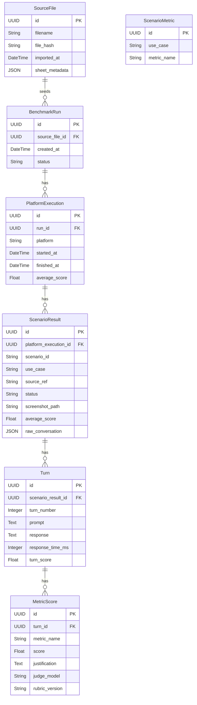

# Data model

Scorekeeper stores benchmark results as a hierarchy. The SQLAlchemy models live
in `src/scorekeeper/database.py`, and the schema is managed with Alembic (see the
"Database migrations" section in the [README](../README.md)). For how metrics are
defined and scored, see [Evaluation metrics](evaluation-metrics.md).

## Overview

A **SourceFile** is an imported `.xlsx` of interactions that seeds one or more
**BenchmarkRun** rows. Each run fans out into one **PlatformExecution** per
platform, whose conversations are stored as **ScenarioResult** rows. Every
conversation is split into **Turn** rows (one user/model exchange each), and
each turn is scored by an LLM-as-a-judge into multiple **MetricScore** rows.

Scores flow upward:

- a turn's `turn_score` is the **weighted mean of its `MetricScore` values,
  normalized to [0, 1]**. Metrics score on their own scale (1-5, 0-1, boolean);
  each raw score is normalized and weighted using the metric's `scale`/`weight`,
  which live in code (`scorekeeper.metrics`) keyed by `metric_name`,
- a scenario's `average_score` averages its turns' `turn_score`,
- a platform's `average_score` averages its scenarios' `average_score`.

`MetricScore.score` stores the **raw** score in the metric's own scale;
normalization happens at rollup (`scorekeeper.metrics.rollup`). Because scale and
weight are code metadata (not stored per score), recomputing an old run applies
the *current* weights/scales — `rubric_version` captures rubric drift but not
weight drift. This is acceptable for a benchmarking tool whose rollups are
derived and recomputable.

Which metrics apply to a scenario is data, stored in **ScenarioMetric** and keyed
by `use_case`. Each metric class declares its scenarios via the `@register`
decorator; `scorekeeper.metrics.selection.sync_selection` materializes that
declaration into the table, and the scoring runner reads it to pick the metric
subset per scenario.

## ER diagram

`ScenarioMetric` is a standalone selection table (no FK into the run hierarchy):
it is joined to scenarios by matching `use_case`.

## Entities

### SourceFile

An imported `.xlsx` file of interactions — the source of one or more runs.

| Column | Type | Notes |
| --- | --- | --- |
| `id` | UUID | Primary key. |
| `filename` | String(512) | Name of the imported file. |
| `file_hash` | String(128) | Content hash (indexed) for reproducibility and dedup. |
| `imported_at` | DateTime (tz) | When the file was imported. |
| `sheet_metadata` | JSON / JSONB | Sheet names, row counts, column mapping, etc. recorded by the importer. |

### BenchmarkRun

One benchmark invocation across one or more platforms.

| Column | Type | Notes |
| --- | --- | --- |
| `id` | UUID | Primary key. |
| `source_file_id` | UUID | FK → `source_files.id`, `ON DELETE SET NULL`. Nullable; the file the run was seeded from. |
| `created_at` | DateTime (tz) | When the run was created. |
| `status` | String(32) | Run lifecycle, e.g. `pending`, `running`, `completed`. |

### PlatformExecution

Results for a single platform (Copilot, Gemini, Claude) within a run.

| Column | Type | Notes |
| --- | --- | --- |
| `id` | UUID | Primary key. |
| `run_id` | UUID | FK → `benchmark_runs.id`, `ON DELETE CASCADE`. |
| `platform` | String(64) | Platform identifier. |
| `started_at` | DateTime (tz) | Nullable until the execution begins. |
| `finished_at` | DateTime (tz) | Nullable until the execution ends. |
| `average_score` | Float | Mean of this platform's scenario averages; computed after scoring. |

### ScenarioResult

One conversation loaded from the source file for a use case.

| Column | Type | Notes |
| --- | --- | --- |
| `id` | UUID | Primary key. |
| `platform_execution_id` | UUID | FK → `platform_executions.id`, `ON DELETE CASCADE`. |
| `scenario_id` | String(128) | Identifier of the scenario / use case tested. |
| `use_case` | String(128) | Human-readable use case label. |
| `source_ref` | String(256) | Reference into the source file: sheet name, conversation key, or row range. |
| `status` | String(32) | Scenario lifecycle status. |
| `screenshot_path` | String(512) | Path to a stored screenshot (binary kept on disk, not in the DB). |
| `average_score` | Float | Mean of this conversation's `turn_score` values. |
| `raw_conversation` | JSON / JSONB | Parsed rows for this conversation from the source file. JSONB on PostgreSQL, JSON on SQLite. `Turn` rows are the evaluation projection derived from it. |

### Turn

One user/model exchange within a conversation, evaluated on its own.

| Column | Type | Notes |
| --- | --- | --- |
| `id` | UUID | Primary key. |
| `scenario_result_id` | UUID | FK → `scenario_results.id`, `ON DELETE CASCADE`. |
| `turn_number` | Integer | Order of the turn within the conversation. |
| `prompt` | Text | User message. |
| `response` | Text | Model response. |
| `response_time_ms` | Integer | Response latency, if available. |
| `turn_score` | Float | Composite score for the turn; mean of its `MetricScore` values. |

### MetricScore

An LLM-as-a-judge score for a single metric on a single turn. A turn has many.

| Column | Type | Notes |
| --- | --- | --- |
| `id` | UUID | Primary key. |
| `turn_id` | UUID | FK → `turns.id`, `ON DELETE CASCADE`. |
| `metric_name` | String(128) | Name of the evaluated metric. |
| `score` | Float | Numeric score for the metric. |
| `justification` | Text | Judge's rationale for the score. |
| `judge_model` | String(128) | Model that produced the score, for reproducibility. |
| `rubric_version` | String(64) | Version of the scoring rubric used. |

### ScenarioMetric

Which metric applies to which scenario `use_case`. The metric taxonomy lives in
code; this table is the queryable projection of each metric's decorator-declared
scenarios, materialized by `scorekeeper.metrics.selection.sync_selection`.

| Column | Type | Notes |
| --- | --- | --- |
| `id` | UUID | Primary key. |
| `use_case` | String(128) | Scenario type the metric applies to (indexed). `"default"` is the fallback set used when a `use_case` has no rows. |
| `metric_name` | String(128) | Metric name, validated against the code registry at resolve time (no FK). Unique together with `use_case`. |

## Cascade behavior

The `BenchmarkRun` subtree uses `ON DELETE CASCADE` and SQLAlchemy
`cascade="all, delete-orphan"`, so deleting a `BenchmarkRun` removes its entire
subtree of executions, scenarios, turns, and scores.

The `SourceFile → BenchmarkRun` link uses `ON DELETE SET NULL` instead: deleting
a source file leaves its runs and their results intact, only clearing their
`source_file_id`.
