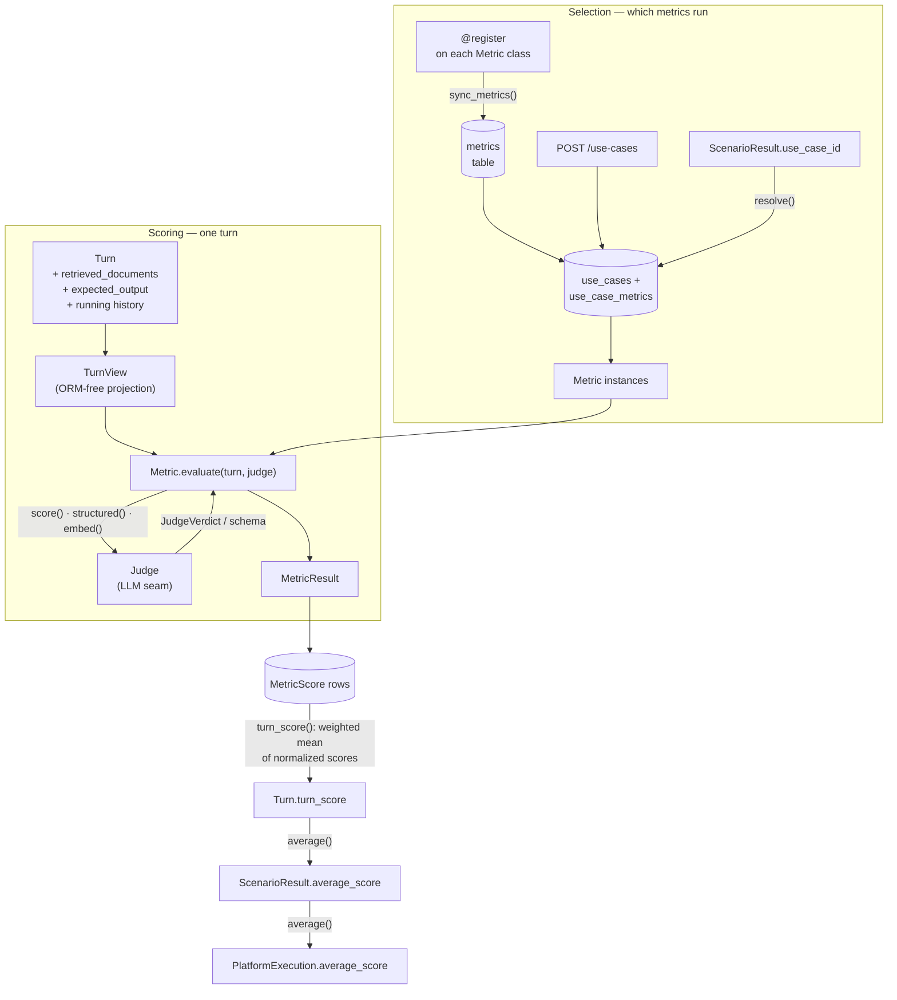

# Evaluation metrics

Scorekeeper scores each conversation **turn** on one or more metrics using an
LLM-as-a-judge. This page describes the metric taxonomy — the classes that define
*what* a metric is and *how* it is scored — and how to add your own.

The taxonomy lives in `scorekeeper-engine/src/scorekeeper/core/metrics/` and is **database-free and
LLM-free**: metrics run against a plain projection of a turn and call the judge
through a swappable seam, so the whole package is unit-testable without a
database or a live model. The concrete metrics themselves are project-specific,
so the `catalog/` package ships **empty** — you add metrics there (see
[Adding a metric](#adding-a-metric)). The concrete metrics that have been added
are documented in the [Metrics catalog](metrics-catalog.md).

## The big picture



- `@register` puts a metric in the code catalog; `sync_metrics()` mirrors its name
  into the `metrics` table and links it to the reserved `default` use case. Every
  *other* use case is user data, composed through `POST /use-cases` and stored in
  `use_case_metrics`.
- The scoring runner follows a scenario's `use_case_id` foreign key, resolves that
  set, and runs each metric's `evaluate()` against the turn — the metrics of a turn
  evaluate concurrently.
- `evaluate()` sees only a `TurnView`: prompt, response, conversation history,
  the turn's retrieved context, and the expected output.
- Each result becomes a `MetricScore` row; rollup turns them into a per-turn
  score and then into scenario and platform averages (see
  [Data model](data-model.md)).

## Core concepts

### `Metric`

`scorekeeper.core.metrics.base.Metric` is the abstract base. **Metadata is class-level;
behavior is the `evaluate()` method.**

| Attribute | Meaning |
| --- | --- |
| `name` | Stable identifier; stored in `MetricScore.metric_name`. |
| `category` | A `MetricCategory` for grouping/reporting. |
| `scale` | A `Scale` (see below); the raw score's range. |
| `weight` | Relative weight in the rollup (default `1.0`). |
| `rubric_version` | Rubric version string; stored on each score (default `"v1"`). |

Which use cases a metric belongs to is deliberately **not** class metadata: that
mapping is user data, composed through `POST /use-cases`.

```python
class Metric(ABC):
    name: ClassVar[str]
    category: ClassVar[MetricCategory]
    scale: ClassVar[Scale]
    weight: ClassVar[float] = 1.0
    rubric_version: ClassVar[str] = "v1"

    @abstractmethod
    def evaluate(self, turn: TurnView, judge: Judge) -> MetricResult: ...

    def normalize(self, raw: float) -> float:
        return self.scale.normalize(raw)
```

`evaluate()` receives a **`TurnView`** (`prompt`, `response`, `turn_number`,
`history`) — never the ORM `Turn` — and a **`Judge`**, and returns a
**`MetricResult`**:

```python
class MetricResult(BaseModel):
    metric_name: str
    raw_score: float          # in the metric's own scale
    normalized_score: float   # always [0, 1], used at rollup
    trace: MetricTrace = MetricTrace()   # structured record, persisted as JSON
    judge_model: str | None = None
    rubric_version: str | None = None
```

The `trace` is a structured `MetricTrace` — a list of `TraceStep`s, each with a
`label`, optional `summary`, and a list of typed `TraceEntry`s (`label`, `value`
of bool/float/str, `justification`, `metadata`). It is persisted as its own
`metric_traces` entity (1:1 with `MetricScore`, `steps` stored as JSON), so lists
(claims, per-node verdicts, similarities) stay arrays instead of being flattened
into one string.

Two ready-made shapes cover almost everything.

### `SingleRubricMetric` — one rubric, one judge call

The common case. Declare a Spanish `rubric` and the metadata; the base class does
the rest.

```python
@register
class Correccion(SingleRubricMetric):
    name = "correccion"
    category = MetricCategory.RAG
    scale = Likert()          # 1-5
    weight = 2.0
    rubric = RUBRICA_CORRECCION   # Spanish prompt template
```

### `MultiStepMetric` — orchestrate several judge calls

When a score needs more than one step (extract → verify → aggregate), subclass
`MultiStepMetric` and implement `evaluate()`. Build a `MetricTrace` of `TraceStep`s
whose `entries` keep the per-item detail as typed `TraceEntry`s.

```python
@register
class SeguridadFactual(MultiStepMetric):
    name = "seguridad_factual"
    category = MetricCategory.RAG
    scale = Unit()            # 0-1
    weight = 3.0

    def evaluate(self, turn, judge):
        steps = []
        extraction = judge.structured(
            instruction=EXTRAER_AFIRMACIONES, turn=turn, schema=Afirmaciones
        )
        steps.append(TraceStep(
            label="Extracción de afirmaciones", summary=extraction.summary,
            entries=[TraceEntry(label=a) for a in extraction.afirmaciones],
        ))

        verdicts = [
            judge.score(rubric=VERIFICAR.format(afirmacion=a), turn=turn,
                        scale=Boolean(), rubric_version=self.rubric_version)
            for a in extraction.afirmaciones
        ]
        steps.append(TraceStep(label="Verificación", entries=[
            TraceEntry(label=a, value=bool(v.score), justification=v.justification)
            for a, v in zip(extraction.afirmaciones, verdicts, strict=True)
        ]))

        raw = sum(v.score for v in verdicts) / len(verdicts) if verdicts else 1.0
        return MetricResult(
            metric_name=self.name, raw_score=raw, normalized_score=self.normalize(raw),
            trace=MetricTrace(steps=steps),
            judge_model=verdicts[0].model if verdicts else None,
            rubric_version=self.rubric_version,
        )
```

### Scales and normalization

Metrics score on their own scale; rollup needs a common range. Each `Scale`
(`scorekeeper.core.metrics.scale`) knows how to map a raw score to `[0, 1]`:

| Scale | Range | `normalize` |
| --- | --- | --- |
| `Likert(lo=1, hi=5)` | `lo`–`hi` | `(raw - lo) / (hi - lo)` |
| `Unit()` | 0–1 | identity |
| `Boolean()` | 0/1 | `1.0 if raw >= 0.5 else 0.0` |

`MetricScore.score` always stores the **raw** score; normalization happens only
at rollup, so the stored value stays interpretable in the rubric's own terms.

### Categories

`MetricCategory` (`scorekeeper.core.metrics.category`) is a data-only `StrEnum`
used for grouping and dashboards. It currently defines a single value, `RAG`;
add categories here as needed — they carry no behavior.

### The Judge seam

Metrics never import an LLM SDK. They depend on the `Judge` **Protocol**
(`scorekeeper.core.metrics.judge`):

```python
class Judge(Protocol):
    def score(self, *, rubric, turn, scale, rubric_version=None) -> JudgeVerdict: ...
    def structured(self, *, instruction, turn, schema: type[T]) -> T: ...
```

- `score()` runs a Spanish rubric prompt and returns a `JudgeVerdict`
  (`score`, `justification`, `model`).
- `structured()` runs a non-scoring step (extraction/classification) and returns
  an instance of the given Pydantic `schema`.

Tests inject a stub that satisfies this Protocol (see
[Testing](#testing)). The real implementation is added later (see
[Going live](#going-live)).

### Token usage

The LLM tokens each judge call consumes are captured **transparently** — metrics
do nothing, and the `Judge` Protocol is unchanged (its return types — `JudgeVerdict`,
a bare schema, bare vectors — carry no usage envelope). Instead the concrete judges
push each call's usage into an *ambient* accumulator:

- The judges read the SDK response's usage `getattr`-safely and call
  `record_usage(...)` (`scorekeeper.core.metrics.judges.base`), normalizing providers to
  input/output (Anthropic `input`/`output_tokens`, OpenAI
  `prompt`/`completion_tokens`; embeddings report input only). A response without
  usage — or any judge stub that never calls `record_usage` — contributes `0`.
- The scoring runner activates one accumulator per turn with `collect_usage(...)`,
  a `contextvars`-scoped context manager. Because metrics evaluate on their own
  threads (one per metric) and a `ThreadPoolExecutor` worker does **not** inherit
  the caller's context, the runner enters the scope *inside each worker* and resets
  it on exit, so nothing leaks across the reused threads. Every judge call — across
  every metric and every internal step — adds to that one thread-safe accumulator.
- After scoring, the per-turn total is persisted as a
  [`TurnTokenUsage`](data-model.md#turntokenusage) row (1:1 with `Turn`).

This is **persistence only**: token counts are stored in the database but are not
surfaced by the read APIs. A standalone judge used outside the runner (no active
accumulator) records nothing — `record_usage` is a no-op — so judges stay usable
on their own.

## Registry and the `@register` decorator

Concrete metrics register themselves with `@register`
(`scorekeeper.core.metrics.registry`), co-located with the class. The decorator takes
no arguments — it declares only that the metric exists and can be scored:

```python
@register
class Correccion(SingleRubricMetric): ...

@register
class Utilidad(SingleRubricMetric): ...
```

`MetricRegistry` provides `get(name)`, `create(name)` (instantiate),
`all()`, `add(cls)`, and `clear()`. Importing `scorekeeper.core.metrics.catalog`
imports every metric module, which is what populates the registry — so **every
metric module must be imported from `catalog/__init__.py`**.

## Per-use-case selection (in the database)

Different scenarios score on different metric subsets. Ownership is split in two:

**The catalog — and `default` — are code.** `selection.sync_metrics(session)` mirrors
every registered metric name into the `metrics` table and links each one to the
reserved `"default"` use case, creating it if missing. So `default` always means
"every metric", and a metric added to the catalog joins it on the next call with no
migration. It is **idempotent and insert-only** — a name dropped from the registry
keeps its row, because a stored set and historical `metric_scores` may still
reference it. The caller commits. It runs automatically on ingest and on
`POST /use-cases`.

**Every other set is data.** Use cases other than `default` are written only through
`POST /use-cases` (see [APIs](apis.md)), which names a set and picks the metrics it
scores; `sync_metrics` never touches them. A metric class does not declare which use
cases it belongs to, so composing a set needs no code change and no deploy. A set can
only reference metrics that exist in the registry — the API answers `422` otherwise.
Create one when you want a **narrower** set than `default`'s everything.

Reading a set back:

- `selection.metrics_for(session, use_case_id)` returns the metric names linked to a
  use case, ordered by name. There is no fallback: an empty list would be a real
  answer, not a miss. In practice it cannot happen — `default` carries the whole
  registry and `POST /use-cases` rejects an empty `metrics` list.
- `selection.resolve(session, use_case_id)` instantiates those metrics, raising a
  Spanish `KeyError` if a stored name is not in the code registry.

```python
from scorekeeper.db.connection import SessionLocal
from scorekeeper.core.services.use_cases import create_use_case
from scorekeeper.core.metrics.selection import resolve

async with SessionLocal() as session:
    uc = await create_use_case("soporte_tecnico", ["correccion"], session=session)
    metrics = await resolve(session, uuid.UUID(uc["id"]))   # [Metric, Metric, ...]
```

## Rollup

`scorekeeper.core.metrics.rollup.turn_score(scores)` computes a turn's score as the
**weighted mean of normalized metric scores**. It takes anything with
`metric_name` and `score` (e.g. `MetricScore` rows), looks up each metric's
`scale`/`weight` in the registry, normalizes, and weights:

```
turn_score = Σ (scale.normalize(score) · weight) / Σ weight
```

`average(values)` (aliased as `scenario_average` / `platform_average`) is the
plain mean of the non-null children, used for scenario and platform rollups.

Because scale and weight are code metadata (not stored per score), recomputing an
old run applies the *current* weights/scales — `rubric_version` captures rubric
drift but not weight drift. This is acceptable for a tool whose rollups are
derived and recomputable.

## Adding a metric

1. Create a module `scorekeeper-engine/src/scorekeeper/core/metrics/catalog/<nombre>.py`.
2. Subclass `SingleRubricMetric` (one rubric) or `MultiStepMetric` (several
   steps). Set `name`, `category`, `scale`, `weight`, and — for single-rubric —
   the Spanish `rubric`.
3. Decorate it with `@register`.
4. Import the module in `catalog/__init__.py` so it registers on import.
5. Link it to the use cases that should score it via `POST /use-cases` — no code
   change needed, and `GET /metrics` lists it as soon as the process restarts.
6. Add a unit test (see below).

```python
# scorekeeper-engine/src/scorekeeper/core/metrics/catalog/claridad.py
from scorekeeper.core.metrics.base import SingleRubricMetric
from scorekeeper.core.metrics.category import MetricCategory
from scorekeeper.core.metrics.registry import register
from scorekeeper.core.metrics.scale import Likert

RUBRICA_CLARIDAD = """\
Evalúa la CLARIDAD de la respuesta (1-5): {prompt} {response}
Devuelve la puntuación y una justificación breve en español.
"""

@register
class Claridad(SingleRubricMetric):
    name = "claridad"
    category = MetricCategory.RAG
    scale = Likert()
    weight = 1.0
    rubric = RUBRICA_CLARIDAD
```

```python
# scorekeeper-engine/src/scorekeeper/core/metrics/catalog/__init__.py
from scorekeeper.core.metrics.catalog import claridad  # noqa: F401
```

## Testing

Metric classes are testable with **no database and no LLM**. Inject a stub judge
that satisfies the `Judge` Protocol and returns scripted verdicts; assert on the
`MetricResult`. For multi-step metrics, assert the **call order/count** and the
structured `trace.steps` / `entries` (labels, typed `value`s, `metadata`).
Selection tests run against an
in-memory SQLite session. See `tests/metrics/` for the patterns, including a
`registered_metrics` fixture that isolates the global registry per test.

```python
class StubJudge:
    def __init__(self, verdicts=None, extractions=None):
        self._verdicts = list(verdicts or []); self._ext = list(extractions or [])
        self.calls = []
    def score(self, *, rubric, turn, scale, rubric_version=None):
        self.calls.append("score"); return self._verdicts.pop(0)
    def structured(self, *, instruction, turn, schema):
        self.calls.append("structured"); return self._ext.pop(0)
```

## Going live

No LLM SDK is wired up yet. To score for real:

1. Add a judge implementation under `scorekeeper/metrics/judges/` that satisfies
   the `Judge` Protocol (e.g. `AnthropicJudge`, using the latest Claude models via
   structured/JSON tool output for the score and Spanish justification).
2. Add its SDK (e.g. `anthropic`) to `pyproject.toml`.
3. Build the scoring runner that: reads each `ScenarioResult.use_case`, calls
   `resolve(session, use_case)`, runs `evaluate()` per turn, persists
   `MetricScore` rows, and fills `Turn.turn_score` /
   `ScenarioResult.average_score` / `PlatformExecution.average_score` via
   `rollup`.

Because metrics depend only on the `Judge` Protocol, none of the taxonomy changes
when the SDK lands — only the new judge file and the runner.
