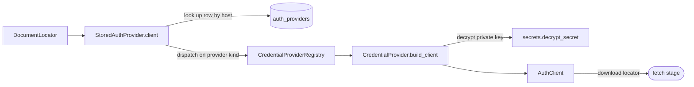
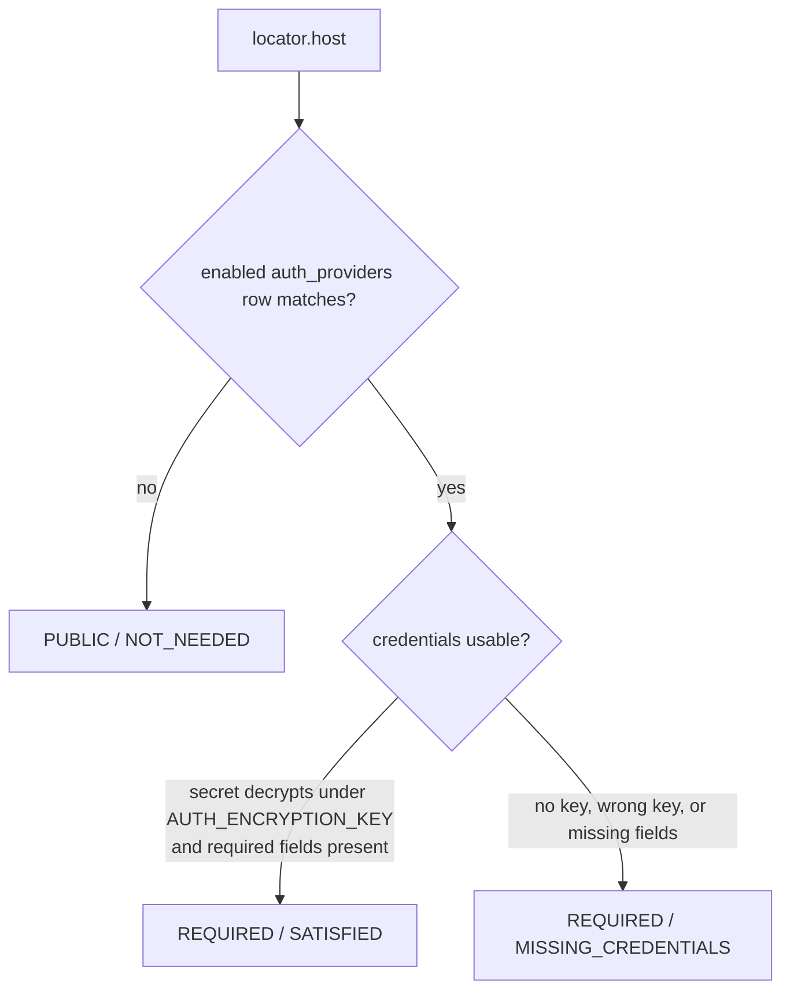

# Retrieval credentials

The [retrieval pipeline](retrieval-pipeline.md)'s **authorize** stage needs credentials to
fetch documents that a host gates behind authentication (SharePoint, an intranet, …). This
page documents the credential subsystem that supplies them:
`scorekeeper.core.retrieval.credentials` — a **database-backed `AuthProvider` taxonomy** whose
settings live in the [`auth_providers`](data-model.md#authproviderconfig) table and whose
concrete providers authenticate against a backend — SharePoint with a client **certificate**,
or any OAuth2 resource with a **client-credentials** bearer token.

It is the credential source the earlier `HostRuleAuthProvider` left injected and empty. For
where the authorize stage sits in the stage flow and how `AuthStatus` maps onto a
`RetrievalStatus`, see [Retrieval pipeline § Authentication](retrieval-pipeline.md#authentication)
and [Retrieval taxonomy § Authorization](retrieval-taxonomy.md#authorization). For a C4
component view of this subsystem, see [Architecture § Level 3](architecture.md#level-3--components-retrieval-pipeline--credential-subsystem).

## The AuthProvider taxonomy

`AuthProvider` (`scorekeeper.core.retrieval.protocols`) is the authorize-stage contract. It has two
concrete implementations, injected into the pipeline like every other stage:

| Implementation | Module | Credential source | Carries credentials via |
| --- | --- | --- | --- |
| `HostRuleAuthProvider` | `retrieval.auth` | injected `host → bearer token` map | `headers()` (bearer) |
| `StoredAuthProvider` | `retrieval.credentials` | `auth_providers` table | `client()` (generic `AuthClient`) |

Both satisfy the same protocol — `classify(locator) → AuthDecision`, `headers(locator)`, and
`client(locator) → AuthClient | None` — so the pipeline treats them interchangeably.
`HostRuleAuthProvider` is the header/bearer path (its `client()` is always `None`);
`StoredAuthProvider` is the database-backed path described here (its `headers()` is always
empty).

### The generic client

The fetch stage must not know *how* a document is authenticated — a SharePoint request, an
HTTP GET with a token, something else. So the authorize stage hands it a backend-agnostic
**`AuthClient`**:

```python
class AuthClient(Protocol):
    kind: str
    def download(self, locator: DocumentLocator) -> bytes: ...
```

`StoredAuthProvider.client(locator)` builds one by dispatching on the row's `provider` kind to
a registered `CredentialProvider`, which wraps its backend. The pipeline calls
`client.download(locator)`; the concrete client translates that into whatever its backend
needs. Clients are built lazily and cached per host. The shipped clients are:

| `AuthClient` | `kind` | Backend / `download` |
| --- | --- | --- |
| `SharePointClient` | `sharepoint` | office365 `ClientContext`; streams the file by server-relative URL |
| `OAuth2Client` | `oauth2` | `httpx2` GET with an `Authorization: Bearer` token from the client-credentials grant |



## Status resolution

`StoredAuthProvider.classify` maps a locator's host onto an `AuthDecision`:



Host matching is case-insensitive and suffix-based: a row's `host` matches a locator host
equal to it or a subdomain of it (store `sharepoint.com` to gate every subdomain, or a
specific host); when several rows match, the most specific (longest `host`) wins.

Crucially, `SATISFIED` vs `MISSING_CREDENTIALS` is decided **without importing the backend
SDK** — `CredentialProvider.credentials_available` only checks that the required non-secret
fields are present and the stored secret decrypts. Whether the SDK is installed is a
fetch-time concern surfaced when `client()` actually builds the backend client.

## Secret encryption

Certificate private keys must be recoverable at run time to build a client, so they are
**encrypted** (reversible), not hashed (one-way). `retrieval.credentials.secrets`:

- generates a fresh random **per-row salt** (`private_key_salt`),
- derives a key from the deployment master secret `AUTH_ENCRYPTION_KEY` and that salt via
  **PBKDF2-HMAC-SHA256**,
- seals the PEM with **Fernet** (the token bundles nonce, ciphertext, and auth tag), stored as
  `private_key_encrypted`.

The encrypted columns hold whichever secret the provider kind needs — a certificate private
key (SharePoint) or an OAuth2 client secret — read back through `AuthProviderConfig.decrypted_secret`
(`decrypted_private_key` is a cert-flavoured alias). A per-row salt means two rows holding the
same secret never share a derived key or ciphertext, and rotating `AUTH_ENCRYPTION_KEY`
invalidates every stored token at once. The plaintext columns hold only non-secret identifiers;
kind-specific non-secret config (e.g. the OAuth2 token URL / scope) goes in the `settings` JSON.
A wrong or missing master key raises `SecretError`, which the authorize stage reports as
`MISSING_CREDENTIALS`.

## The SharePoint provider

`retrieval.credentials.catalog.sharepoint` registers `SharePointCredentialProvider`
(`kind = "sharepoint"`). It authenticates with an Azure AD app **client certificate**:

```python
ClientContext(site_url).with_client_certificate(
    tenant=..., client_id=..., thumbprint=..., private_key=...
)
```

`build_client` validates the required fields (`tenant_id`, `client_id`, `thumbprint`,
`site_url`), decrypts the private key with `AUTH_ENCRYPTION_KEY`, and returns a
`SharePointClient` wrapping the authenticated `ClientContext`. Its `download` resolves the
located document to a server-relative URL and streams the bytes through that context. The
`office365` SDK is imported **lazily** and ships in the optional `retrieval` extra, so the
taxonomy stays importable (and testable) without it — a missing SDK raises `CredentialError`.

## The OAuth2 provider

`retrieval.credentials.catalog.oauth2` registers `OAuth2CredentialProvider` (`kind = "oauth2"`)
for any resource protected by an OAuth2 **client-credentials** grant (machine-to-machine — the
only flow that fits headless fetching; there is no interactive redirect). `build_client`
requires `client_id` (column) and `token_url` (in `settings`), decrypts the client secret, and
returns an `OAuth2Client`. That client POSTs the client-credentials grant to `token_url`,
**caches** the access token until shortly before it expires, and `download` issues an
`httpx2` GET with an `Authorization: Bearer` header. `httpx2` is a core dependency (imported
lazily; injectable in tests), so no extra install is needed.

## Configuring a provider

1. Install the SharePoint SDK: `uv sync --extra retrieval`.
2. Set the master secret in the environment (see `.env.example`):
   ```
   AUTH_ENCRYPTION_KEY=<deployment master secret>
   ```
3. Insert an enabled `auth_providers` row. `AuthProviderConfig.from_sharepoint` encrypts the
   PEM on the way in:
   ```python
   from scorekeeper.db.connection import SessionLocal
   from scorekeeper.db.models import AuthProviderConfig
   from scorekeeper.config.settings import get_settings

   with SessionLocal() as db:
       db.add(AuthProviderConfig.from_sharepoint(
           host="cognitactix-my.sharepoint.com",
           tenant_id="<tenant-guid>",
           client_id="<app-client-id>",
           thumbprint="<cert-thumbprint>",
           site_url="https://cognitactix-my.sharepoint.com/sites/x",
           private_key=open("sp-cert.pem").read(),
           encryption_key=get_settings().auth_encryption_key,
       ))
       db.commit()
   ```

For an OAuth2 provider, use `AuthProviderConfig.from_oauth2` — it encrypts the client secret
and stores the endpoint/scope in `settings` (the SharePoint SDK extra is not needed):

```python
db.add(AuthProviderConfig.from_oauth2(
    host="api.example.com",
    client_id="<oauth2-client-id>",
    client_secret="<oauth2-client-secret>",
    token_url="https://idp.example.com/oauth2/token",
    scope="files.read",
    encryption_key=get_settings().auth_encryption_key,
))
```

With the row in place, a locator whose host matches resolves to `SATISFIED` and
`StoredAuthProvider.client(locator)` yields an authenticated `AuthClient`.

Rows can also be managed over HTTP via the
[auth-providers CRUD endpoints](apis.md#auth-providers-crud) (`scorekeeper.core.retrieval.credentials.service`).
The `private_key` is write-only there: accepted on create/update, stored encrypted, and never
returned (reads expose only `has_private_key`).

## Adding a provider kind

The taxonomy mirrors the [metric catalog](evaluation-metrics.md): one module per provider
under `credentials/catalog/`, registered at import time.

1. Subclass `CredentialProvider`, set `kind`, and decorate with
   `@register_credential_provider`.
2. Override `require_settings(config)` to validate the non-secret fields your backend needs
   (raise `CredentialError` listing what is missing) — this feeds the classify-time
   availability check with no SDK import.
3. Implement `build_client(config, *, encryption_key) → AuthClient`: import the backend SDK
   lazily, decrypt the secret via `config.decrypted_private_key(encryption_key)`, and return
   an object satisfying `AuthClient` (a `kind` attribute and a `download`).
4. Import the module from `credentials/catalog/__init__.py` so it registers.

Reuse `AuthProviderConfig.settings` (a JSON column) for fields that don't map onto the
SharePoint-specific columns.

## Security notes

- Private keys are encrypted at rest with a per-row salt; only non-secret identifiers are
  stored in the clear. Guard `AUTH_ENCRYPTION_KEY` — it is the single secret that decrypts
  every row, and rotating it invalidates all stored tokens (re-encrypt each row afterward).
- Building a client performs no network I/O beyond what the backend SDK defers to first use;
  classify performs none.
