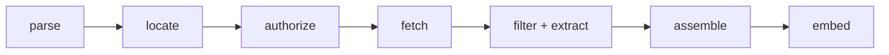

# Retrieval pipeline

A turn's [`retrieved_context`](data-model.md#retrieved_context-json-schema) is the set
of documents a RAG answer was grounded on. But the source `.xlsx` cells do **not** carry
document text — they carry a ranked list of *source references* (a label + a URL, often
with a `#page=N` fragment and sometimes an index). The retrieval pipeline turns those
references into the stored `RetrievedContext` schema by fetching and extracting the
referenced text.

> **Status:** the full pipeline is implemented — the **taxonomy**
> (`scorekeeper.core.retrieval.types`, `scorekeeper.core.retrieval.protocols`), every stage (**parse**,
> **locate**, **authorize**, **fetch**, **extract**, **assemble**), the **credential source**
> (`scorekeeper.core.retrieval.credentials`), and the **orchestrator**
> (`RetrievalOrchestrator`) that a Celery worker runs before scoring (see
> [Orchestration](#orchestration)). Remaining follow-ons are in [Deferred phases](#deferred-phases).

The enums, value objects, and outcome/status taxonomy are documented in
[Retrieval taxonomy](retrieval-taxonomy.md); this page covers the stage flow that produces
and consumes them.

## Cell formats

The `retrieved_context` cell appears in three encodings in real files (plus the legacy
plain-text blob). `SourceFormat` names them:

| `SourceFormat` | Example |
| --- | --- |
| `PIPE_LABELLED` | `eleconomista.com.mx (https://…) \| cognitactix-my.sharepoint.com (https://….pdf#page=3)` |
| `JSON_NAME_URL` | `[{"name": "cognos.bmv.com.mx", "url": "https://….pdf"}, …]` |
| `JSON_INDEXED` | `[{"index": "1-abc", "url": "https://….pdf#page=1", "name": "cognitactix-my.sharepoint.com"}, …]` |
| `PLAINTEXT` | free-form text (legacy fallback) |
| `EMPTY` | blank cell |

## Stages



There is no standalone *filter* stage: the page/section selection the diagram once split out
is performed inside the `ContentExtractor` (see [Extract](#extract)).

| Stage | Protocol | Input → Output | Purpose |
| --- | --- | --- | --- |
| parse | `SourceRefParser` | `cell` → `list[SourceRef]` | Detect the `SourceFormat` and split the cell into ranked source references. |
| locate | `DocumentLocatorResolver` | `SourceRef` → `DocumentLocator` | Derive the document URL (minus fragment), filename, `DocType`, scheme, host, and page/section from a `#page=N` fragment. |
| authorize | `AuthProvider` | `DocumentLocator` → `AuthDecision` (+ `client`) | Classify the auth requirement, resolve it against available credentials, and expose the generic `AuthClient`. |
| fetch | `DocumentFetcher` | `DocumentLocator`, `AuthClient \| None` → `FetchedDocument` | Fetch the document bytes through the auth client (gated) or a public GET, cached on disk by `document_url`. |
| filter + extract | `ContentExtractor` | `FetchedDocument`, `DocumentLocator` → `ExtractedContent` | Convert the document to markdown page by page (titles/lists/tables; images dropped) and segment it into page-attributed sentences. |
| assemble | `RetrievalReport.to_context` | outcomes → `RetrievedContext` | Collect the successfully-retrieved documents, in rank order; they persist as [`RetrievedDocument`](data-model.md#retrieveddocument) child rows of the turn. |
| embed | `Embedder` | `Sentence` list → chunk rows | Group the sentences into overlapping chunks and embed each one; see [Embedding](#embedding). A phase of its own, after retrieval and before scoring. |

The orchestrator (`RetrievalPipeline.run`) runs all stages over one cell and returns a
`RetrievalReport` — the `SourceFormat` plus one `RetrievalOutcome` per source reference.

## Authentication

Some source URLs (e.g. SharePoint) gate the document behind authentication. The three
real cases map onto `AuthStatus`:

| Case | `AuthRequirement` | `AuthStatus` | Result |
| --- | --- | --- | --- |
| No auth needed | `PUBLIC` | `NOT_NEEDED` | retrieve |
| Auth needed, credentials held | `REQUIRED` | `SATISFIED` | retrieve (with `AuthProvider.headers`) |
| Auth needed, no credentials | `REQUIRED` | `MISSING_CREDENTIALS` | cannot retrieve → `RetrievalStatus.AUTH_MISSING` |

`AuthProvider` is a pluggable protocol with two concrete implementations:

- `HostRuleAuthProvider` (`scorekeeper.core.retrieval.auth`) marks a host `REQUIRED` when it falls
  under a gated domain (SharePoint by default) and resolves it against an injected credential
  store (host → bearer token). Useful for header/bearer auth; its `client()` is `None`.
- `StoredAuthProvider` (`scorekeeper.core.retrieval.credentials`) is the **database-backed**
  credential source. It reads the `auth_providers` table: a host with an enabled row is
  `REQUIRED` and resolves to `SATISFIED` when that provider holds usable credentials (its
  encrypted secret decrypts under `AUTH_ENCRYPTION_KEY`), else `MISSING_CREDENTIALS`.

### Credential taxonomy and the generic client

Each `auth_providers` row carries a `provider` *kind* (e.g. `sharepoint`) that selects a
`CredentialProvider` from the registry (`scorekeeper.core.retrieval.credentials`, mirroring the
metric catalog). A provider turns the row into a backend-agnostic **`AuthClient`** — the
generic client the fetch stage retrieves through, so the pipeline never names SharePoint.
The one concrete provider is **SharePoint** (`credentials/catalog/sharepoint.py`), which
authenticates with an Azure AD **client certificate**:
`ClientContext(site_url).with_client_certificate(tenant, client_id, thumbprint, private_key)`.
The certificate private key is stored **encrypted** on the row (a Fernet token plus a per-row
salt; see `credentials/secrets.py`) and decrypted with the deployment master secret
(`AUTH_ENCRYPTION_KEY`) only when a client is built. Without that key (or with no configured
row), gated documents resolve to `AUTH_MISSING`. The `office365` SDK ships in the optional
`retrieval` extra and is imported lazily.

The credential subsystem — the encryption model, configuring a provider row, and adding a new
provider kind — is documented in full in [Retrieval credentials](retrieval-credentials.md).

## Fetch

`CachingDocumentFetcher` (`scorekeeper.core.retrieval.fetch`) implements the `DocumentFetcher`
stage: `fetch(locator, client) → FetchedDocument`. It consumes the authorize stage's generic
`AuthClient` — so it never names a backend:

- **gated host** → `client.download(locator)` (SharePoint `ClientContext`, OAuth2 bearer GET, …);
- **public host** (`client is None`) → a plain `httpx2` GET; a network/HTTP error raises
  `FetchError` (which the orchestrator maps to `RetrievalStatus.FETCH_FAILED`).

**The response confirms the document type.** The locator's `DocType` comes from the URL alone,
and is merely *provisional* for an extensionless web page, so a public GET's `Content-Type`
overrides it when it names a type we convert (`text/html`, `application/pdf`,
`…wordprocessingml.document`); an absent or unrecognized media type leaves the provisional
type in place. The confirmed type is what the cache stores and what `extract` converts with,
so a `.pdf` URL that actually served an HTML error page converts as HTML. An authenticated
download surfaces no `Content-Type`, so a gated document keeps the locator's type.

**Only globally routable targets.** Source references come from a model's answer, so a public
GET refuses a host resolving to a loopback, private, link-local, reserved or multicast address
(→ `FetchError`). Redirects are followed by hand (up to 5 hops) rather than by the client, so
every hop is checked instead of only the first.

**Local filesystem cache.** Every fetch is cached under `RETRIEVAL_CACHE_DIR`, indexed by the
[`document_cache`](data-model.md#documentcacheentry) table (one row per `document_url`, unique).
The first fetch of a URL downloads and stores the bytes; later fetches of the same URL read the
blob off disk (`FetchedDocument.cached = True`), so **a document is downloaded at most once per
platform execution** — across every turn and scenario the execution covers.

**The cache does not outlive the execution.** `CachingDocumentFetcher` remembers every
`document_url` it served, and `purge_cache()` deletes exactly those blobs (and their
`document_cache` rows) when retrieval for a platform execution finishes — see
[Cache cleanup](#cache-cleanup). Nothing downloaded is retained afterwards, so a later run
re-downloads what it needs.

**Duplicates are preserved.** The cache dedups *downloads*, not *results*: `fetch` returns one
`FetchedDocument` per call, so a cell that references the same URL several times yields one
result each (only the first hits the network). This keeps the fetch output aligned 1:1 with the
ranked source references feeding `assemble`.

## Extract

`MarkdownContentExtractor` (`scorekeeper.core.retrieval.extract`) implements the `ContentExtractor`
stage: `supports(doc_type)` + `extract(document, locator) → ExtractedContent`, whose `text` is
**markdown**. It also *is* the filter — page selection happens here, not in a separate stage.
By document type:

- **PDF** → **page by page**. `pypdf` slices each page into a one-page document before
  conversion: with `#page=N` only that page (`locator.page`, 1-based); **without a fragment,
  every page in turn**. A page outside the document raises `PageNotFoundError`
  (→ `RetrievalStatus.LOCATOR_NOT_FOUND`); a PDF with no pages yields no text
  (→ `EMPTY_CONTENT`).
- **DOCX** (Word `.docx`) → the whole document is converted; `.docx` stores no page boundaries,
  so the page selector is ignored. Legacy binary `.doc` is unmapped (`UNKNOWN`) → unsupported.
- **HTML** → the fetched page bytes are converted.

Conversion runs through **MarkItDown** (imported lazily; in the optional `retrieval` extra),
preserving **titles, lists, and tables**. **Images/graphics are dropped** — MarkItDown keeps
images as markdown, so the stage strips image markup (``, ``) from the result. A
type outside {PDF, DOCX, HTML} fails `supports()` (→ `UNSUPPORTED_TYPE`); a corrupt file or
conversion failure raises `ExtractError`. The markdown is not persisted: it is the source of
the sentences below, and the emptiness gate the assemble stage reads.

**Why page by page costs something.** MarkItDown emits no page boundaries, so attributing text
to a page requires slicing the page out first. A PDF referenced without `#page=N` therefore runs
**one conversion per page** instead of one for the whole file: extract time grows linearly with
the page count (it is CPU work, already pushed off the event loop with `asyncio.to_thread`), and
the concatenated markdown is not byte-identical to a single-pass conversion — a table or
paragraph straddling a page break is split at the boundary.

### Sentences

Each converted block is then segmented into `Sentence` values — `{page, index, text}` — with
**syntok** (`scorekeeper.core.text.split_sentences`, the same deterministic segmenter
`faithfulness` uses on the assistant's answer; no LLM call). `page` is the 1-based PDF page the
sentence came from, `None` for DOCX/HTML; `index` orders the sentence across the **whole**
document (0-based, never restarting per page), so it lines up with
`RetrievedDocumentEmbedding.chunk_index`. Segmentation runs on the image-stripped markdown, so
image markup never becomes a sentence.

Sentences are the **chunker's input**, not judge input, and they are not what a judge
reads. They persist on `retrieved_documents.sentences` (JSONB, nullable — rows retrieved
before segmentation existed are `NULL` and carry no text at all). The embedding phase
below turns them into the chunks that *are* read.

## Embedding

A phase of its own between retrieval and scoring
(`scorekeeper.core.services.embedding`). It groups a document's sentences into
**overlapping windows** and stores one
[`RetrievedDocumentEmbedding`](data-model.md#retrieveddocumentembedding) row per window:

- `chunk_sentences` (`scorekeeper.core.retrieval.chunk`) advances by
  `embedding_chunk_sentences - embedding_chunk_overlap` sentences per chunk, so
  consecutive chunks share `embedding_chunk_overlap` sentences. The overlap is what keeps
  a claim straddling a chunk boundary readable in at least one chunk. An overlap not
  smaller than the window would never advance, and is rejected. Each window carries **where
  it came from**, not just its text — otherwise grouping would throw away the page the
  extract stage attributed to every sentence.
- `OpenAIEmbedder` (`scorekeeper.core.retrieval.embed`) embeds the chunks in batches of
  `embedding_batch_size`. It owns **its own OpenAI client** rather than going through
  `Judge.embed`: embedding retrieved documents is retrieval work, and it has to keep
  working whatever judge provider a run uses (Anthropic has no embedding endpoint, LM
  Studio's model is the wrong width). A vector whose width is not
  `EMBEDDING_DIMENSIONS` (1536, the pgvector column's fixed width) is rejected as
  `EmbedError` rather than left to fail inside an INSERT.

**Chunking and embedding are separable, deliberately.** The chunks are the document's
*only* stored text, so they are written whatever happens; the vector is the enrichment
that lets scoring narrow them. With no `openai_api_key`, or when the embeddings call
fails, the chunks are stored with a `NULL` embedding and a judge still reads the whole
document — only the narrowing is lost.

**Provenance travels with the chunk.** Each row records the page its first sentence came
from and the inclusive `Sentence.index` range it spans, so a chunk can be cited or checked
against `retrieved_documents.sentences`. Because only one page is kept, a window straddling
a page break is filed under the page its *head* came from — its tail is mis-attributed, which
is the price of a single column. These fields are storage only: the retrieval query does not
select them and no judge sees them.

**Best-effort and idempotent**, like retrieval: a failure is logged, never raised, and a
document that already has chunks is skipped, so a retried turn re-downloads nothing and
re-embeds nothing.

### What the judge reads

At scoring time `EvalRunner` embeds the turn's **prompt** once, and each document keeps
only its `embedding_top_k` chunks closest to it by cosine, put back in `chunk_index`
order — a judge reads a document in its own order, never shuffled by relevance. That is
the whole point of the phase: a 300-page PDF no longer enters every judge prompt in full.

**Documents are never reordered.** Only the chunks *within* a document are narrowed;
the documents keep their `rank`, which is the *platform's* retriever order and the thing
`contextual_precision` scores. Ranking documents by our own cosine would make that metric
measure our retriever instead of the one under test.

**The ranking runs in SQL.** `db.repositories.embeddings.chunks_for_turn` issues one
statement per turn — a `LATERAL` top-`k` per document over pgvector's `<=>` cosine-distance
operator:

```sql
SELECT d.id, s.chunk_index, s.content
FROM retrieved_documents d
CROSS JOIN LATERAL (
    SELECT e.chunk_index, e.content
    FROM retrieved_document_embeddings e
    WHERE e.retrieved_document_id = d.id
    ORDER BY e.embedding <=> :prompt_embedding
    LIMIT :k
) s
WHERE d.turn_id = :turn_id
```

The `embedding` column is never selected, and `Turn.retrieved_documents` is no longer
loaded down to its chunks — so a run's 1536-float vectors stay in the database instead of
being pulled into the worker for every turn.

**About the HNSW index.** `ORDER BY <=> … LIMIT` is written bare on purpose: it is the only
form `ix_retrieved_document_embeddings_hnsw` (HNSW, `vector_cosine_ops`) can serve, and any
extra ordering key ahead of the distance would silently make the index unusable. Two things
follow, and both are worth knowing before claiming the index is doing work:

- **Whether the planner picks it is its call.** Filtered to one `retrieved_document_id`,
  the candidate set is a handful of rows, and an exact scan over the foreign-key index is
  both faster and — unlike HNSW, which is approximate — exact. Check with `EXPLAIN` rather
  than assume. Filtered HNSW scans also need `hnsw.iterative_scan` (pgvector ≥ 0.8 on the
  *server*) to return reliably; `compose.yaml` pins only the floating `pgvector/pgvector:pg17`
  tag, so that is not enabled here.
- **Unvectorised chunks behave differently per plan.** `<=>` on a `NULL` embedding yields
  `NULL`, and `NULL`s sort last — so an exact scan puts them at the end, where `LIMIT` may
  drop them. An HNSW index scan does not index `NULL`s at all, so it omits them outright.
  Either way a partially embedded document can be truncated.

**Outside PostgreSQL there is no ranking.** The SQLite fallback has no `<=>`
(`EmbeddingColumn` degrades to JSON), so every chunk is returned in `chunk_index` order —
the same degradation `db.connection.run_lock` applies to advisory locks. The same happens
whenever there is no prompt embedding to rank against: no `openai_api_key`, or an embedding
call that failed. Handing a judge the whole document beats handing it nothing.

## Assemble

The assemble stage turns each reference's extract result into the stored
[`RetrievedContext`](data-model.md#retrieveddocument):

- `ExtractedContent.to_document(source, locator)` (`scorekeeper.core.retrieval.types`) maps a
  reference to a `RetrievedDocument` — `name` from the reference label, `document` from the
  filename (falling back to the label, then the URL), `sentences` = the segmented text, and
  `url` = the original `source.url` (keeping any `#page=N` citation anchor). No
  whole-document text is carried: `ExtractedContent.text` stops here.
- `RetrievalOutcome.assembled(source, locator, extracted, *, auth=…)` produces the reference's
  terminal outcome: non-blank markdown → `RETRIEVED` carrying that document; blank text →
  `EMPTY_CONTENT` with no document.
- `RetrievalReport.to_context()` collects the `RETRIEVED` outcomes into a `RetrievedContext`,
  **in retriever-rank order** and **preserving duplicates** (the same URL referenced twice
  yields two documents, matching the fetch stage's 1:1 result-per-reference contract).

Pure value-object logic — no I/O. What is assembled is not yet readable by a judge: the
sentences become judge-visible text only once the [embedding](#embedding) phase has chunked
them.

## Per-document outcome

Each source reference ends in a `RetrievalStatus`:

`PENDING` → `RETRIEVED` · `AUTH_MISSING` · `FETCH_FAILED` · `UNSUPPORTED_TYPE` ·
`UNSUPPORTED_SCHEME` · `LOCATOR_NOT_FOUND` · `EMPTY_CONTENT` · `PARSE_ERROR`.

`RetrievalSummary.from_outcomes` tallies these into counts. Together with the run-level
`STATUS_EN_RECUPERACION` status, this lets `GET /evaluations` surface the retrieval phase
and report how many documents were retrieved vs. blocked (e.g. by missing credentials).

## Orchestration

`RetrievalOrchestrator` (`scorekeeper.core.retrieval.pipeline`) implements `RetrievalPipeline.run`:
it threads one cell parse → locate → authorize → fetch → extract → assemble into a
`RetrievalReport`, building each `RetrievalOutcome` (via `RetrievalOutcome.assembled` on
success) and catching each stage's typed error onto the matching `RetrievalStatus`
(**best-effort** — a failed reference is recorded, never raised, so the rest of the cell still
retrieves):

| Stage result | `RetrievalStatus` |
| --- | --- |
| the located URL is not http(s) (checked before authorize) | `UNSUPPORTED_SCHEME` |
| `classify` = `MISSING_CREDENTIALS`, or `CredentialError` building the client | `AUTH_MISSING` |
| `supports(doc_type)` False (checked before fetch) | `UNSUPPORTED_TYPE` |
| `FetchError` | `FETCH_FAILED` |
| `PageNotFoundError` | `LOCATOR_NOT_FOUND` |
| other `ExtractError` (corrupt/convert failure) | `FETCH_FAILED` |
| whole-cell parse failure (e.g. the LLM path) | one `PARSE_ERROR` outcome |

**Run wiring.** Note the description below predates the per-turn chain: production runs
one Celery job per turn (`core.services.chain._work_turn`), which retrieves, embeds and
scores that turn, committing each phase separately. The whole-run functions described
here are the in-process `ingest -> retrieve -> embed -> score` path.

The Celery worker runs retrieval *then* scoring for a run via one task,
`run_pipeline_task(run_id)` (`scorekeeper.tasks`): `services.retrieval.retrieve_run` then
`services.scoring.score_run`. `retrieve_run` marks the run `en_recuperacion`, and for each turn
parses/fetches/extracts its raw `Turn.retrieved_context_source` (captured at ingest) into
`retrieved_documents` — committing **per scenario**, best-effort, so a hard phase exception
marks the run `fallido` while per-document failures just shrink the context. Scoring then reads
`retrieved_documents` as before. The run lifecycle is
`ingerido → en_cola → en_recuperacion → en_proceso → completado|parcial|fallido`
(ingestion persists at `ingerido`; `POST /evaluations/{run_id}/start` enqueues it).

### Cache cleanup

Downloaded documents are working material, not results: the extracted markdown is persisted on
`retrieved_documents`, and scoring reads only that. So `retrieve_run` calls
`RetrievalPipeline.purge_cache()` once a **platform execution**'s scenarios are all retrieved
(and again on the failure path, so a `fallido` run leaves nothing behind). The purge:

- removes only the `document_url`s *this* pipeline served, leaving a concurrently-running
  execution's cache entries untouched;
- deletes each blob and its `document_cache` row together, pruning the shard directory when it
  empties;
- is **best-effort** — a cleanup error is logged (`No se pudo limpiar la caché de …`) and
  swallowed, since the context is already stored and a stranded blob is not worth failing a run.

The consequence is deliberate: the fetch cache dedups downloads *within* a platform execution
only. `RETRIEVAL_CACHE_DIR` returns to empty between executions rather than growing without
bound, and the same document referenced by a later run is fetched again.

## Deferred phases

Not yet implemented:

- Vector search across the whole corpus. Ranking is scoped to one turn's documents, so no
  query is selective-free enough for the HNSW index to be the obvious plan; see
  [What the judge reads](#what-the-judge-reads).
- Enabling `hnsw.iterative_scan` for reliable filtered index scans, which needs the server
  extension pinned to pgvector ≥ 0.8 (`compose.yaml` uses a floating image tag today).
- `GET /evaluations` surfacing per-run retrieval stats: `RetrievalSummary` counts and the
  `recuperacion_parcial` / `recuperacion_fallida` rollups documented in
  [Retrieval taxonomy](retrieval-taxonomy.md#run-level-status). Retrieval currently logs its
  per-turn summary but the API response reports only scoring status.
