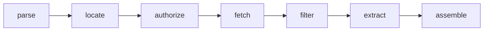

# Retrieval pipeline

A turn's [`retrieved_context`](data-model.md#retrieved_context-json-schema) is the set
of documents a RAG answer was grounded on. But the source `.xlsx` cells do **not** carry
document text — they carry a ranked list of *source references* (a label + a URL, often
with a `#page=N` fragment and sometimes an index). The retrieval pipeline turns those
references into the stored `RetrievedContext` schema by fetching and extracting the
referenced text.

> **Status:** the **taxonomy** (`scorekeeper.retrieval.types`,
> `scorekeeper.retrieval.protocols`), the **parse**, **locate**, and **authorize** stages,
> and the **credential source** (`scorekeeper.retrieval.credentials`, backed by the
> `auth_providers` table) are implemented. The remaining stage implementations (fetch,
> extract) and the run wiring are added in later phases against these types. See
> [Deferred phases](#deferred-phases).

The enums, value objects, and outcome/status taxonomy are documented in
[Retrieval taxonomy](retrieval-taxonomy.md); this page covers the stage flow that produces
and consumes them.

## Cell formats

The `retrieved_context` cell appears in three encodings in real files (plus the legacy
plain-text blob). `SourceFormat` names them:

| `SourceFormat` | Example |
| --- | --- |
| `PIPE_LABELLED` | `eleconomista.com.mx (https://…) \| cognitactix-my.sharepoint.com (https://….pdf#page=3)` |
| `JSON_NAME_URL` | `[{"name": "cognos.bmv.com.mx", "url": "https://….pdf"}, …]` |
| `JSON_INDEXED` | `[{"index": "1-abc", "url": "https://….pdf#page=1", "name": "cognitactix-my.sharepoint.com"}, …]` |
| `PLAINTEXT` | free-form text (legacy fallback) |
| `EMPTY` | blank cell |

## Stages

| Stage | Protocol | Input → Output | Purpose |
| --- | --- | --- | --- |
| parse | `SourceRefParser` | `cell` → `list[SourceRef]` | Detect the `SourceFormat` and split the cell into ranked source references. |
| locate | `DocumentLocatorResolver` | `SourceRef` → `DocumentLocator` | Derive the document URL (minus fragment), filename, `DocType`, host, and page/section from a `#page=N` fragment. |
| authorize | `AuthProvider` | `DocumentLocator` → `AuthDecision` (+ `headers`) | Classify the auth requirement and resolve it against available credentials. |
| fetch | `DocumentFetcher` | `DocumentLocator`, `AuthDecision` → `FetchedDocument` | Fetch the document bytes (cache by `document_url`). |
| filter + extract | `ContentExtractor` | `FetchedDocument`, `DocumentLocator` → `ExtractedContent` | Select the requested page/section and extract its text. |
| assemble | `RetrievalReport.to_context` | outcomes → `RetrievedContext` | Collect the successfully-retrieved documents, in rank order; they persist as [`RetrievedDocument`](data-model.md#retrieveddocument) child rows of the turn. |

The orchestrator (`RetrievalPipeline.run`) runs all stages over one cell and returns a
`RetrievalReport` — the `SourceFormat` plus one `RetrievalOutcome` per source reference.

## Authentication

Some source URLs (e.g. SharePoint) gate the document behind authentication. The three
real cases map onto `AuthStatus`:

| Case | `AuthRequirement` | `AuthStatus` | Result |
| --- | --- | --- | --- |
| No auth needed | `PUBLIC` | `NOT_NEEDED` | retrieve |
| Auth needed, credentials held | `REQUIRED` | `SATISFIED` | retrieve (with `AuthProvider.headers`) |
| Auth needed, no credentials | `REQUIRED` | `MISSING_CREDENTIALS` | cannot retrieve → `RetrievalStatus.AUTH_MISSING` |

`AuthProvider` is a pluggable protocol with two concrete implementations:

- `HostRuleAuthProvider` (`scorekeeper.retrieval.auth`) marks a host `REQUIRED` when it falls
  under a gated domain (SharePoint by default) and resolves it against an injected credential
  store (host → bearer token). Useful for header/bearer auth; its `client()` is `None`.
- `StoredAuthProvider` (`scorekeeper.retrieval.credentials`) is the **database-backed**
  credential source. It reads the `auth_providers` table: a host with an enabled row is
  `REQUIRED` and resolves to `SATISFIED` when that provider holds usable credentials (its
  encrypted secret decrypts under `AUTH_ENCRYPTION_KEY`), else `MISSING_CREDENTIALS`.

### Credential taxonomy and the generic client

Each `auth_providers` row carries a `provider` *kind* (e.g. `sharepoint`) that selects a
`CredentialProvider` from the registry (`scorekeeper.retrieval.credentials`, mirroring the
metric catalog). A provider turns the row into a backend-agnostic **`AuthClient`** — the
generic client the fetch stage retrieves through, so the pipeline never names SharePoint.
The one concrete provider is **SharePoint** (`credentials/catalog/sharepoint.py`), which
authenticates with an Azure AD **client certificate**:
`ClientContext(site_url).with_client_certificate(tenant, client_id, thumbprint, private_key)`.
The certificate private key is stored **encrypted** on the row (a Fernet token plus a per-row
salt; see `credentials/secrets.py`) and decrypted with the deployment master secret
(`AUTH_ENCRYPTION_KEY`) only when a client is built. Without that key (or with no configured
row), gated documents resolve to `AUTH_MISSING`. The `office365` SDK ships in the optional
`retrieval` extra and is imported lazily.

The credential subsystem — the encryption model, configuring a provider row, and adding a new
provider kind — is documented in full in [Retrieval credentials](retrieval-credentials.md).

## Per-document outcome

Each source reference ends in a `RetrievalStatus`:

`PENDING` → `RETRIEVED` · `AUTH_MISSING` · `FETCH_FAILED` · `UNSUPPORTED_TYPE` ·
`LOCATOR_NOT_FOUND` · `EMPTY_CONTENT` · `PARSE_ERROR`.

`RetrievalSummary.from_outcomes` tallies these into counts. Together with the run-level
`STATUS_EN_RECUPERACION` status, this lets `GET /evaluations` surface the retrieval phase
and report how many documents were retrieved vs. blocked (e.g. by missing credentials).

## Deferred phases

Not yet implemented (each is a follow-on against the taxonomy):

- Concrete `DocumentFetcher` (`httpx2`) and `ContentExtractor` (PDF/HTML — needs a PDF
  library). The fetch stage consumes the authorize stage's generic `AuthClient`
  (`AuthProvider.client`); the SharePoint client's `download` is implemented against it.
  (`SourceRefParser`, `DocumentLocatorResolver`, `AuthProvider`, and the DB-backed credential
  source are implemented — see `scorekeeper.retrieval.{parser,resolver,auth,credentials}`.)
- The run wiring: a Celery retrieval stage between ingest and scoring (mirroring
  `enqueue_score_run`) vs. inline in `ingest_evaluation`.
- `evaluation.STATUS_*` + `GET /evaluations` adopting `STATUS_EN_RECUPERACION` /
  `RetrievalSummary`, and `importer._parse_context` delegating to the pipeline.
