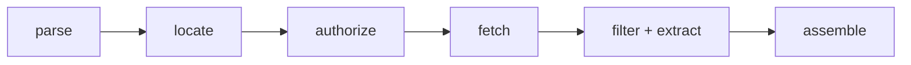

# Retrieval pipeline

A turn's [`retrieved_context`](data-model.md#retrieved_context-json-schema) is the set
of documents a RAG answer was grounded on. But the source `.xlsx` cells do **not** carry
document text — they carry a ranked list of *source references* (a label + a URL, often
with a `#page=N` fragment and sometimes an index). The retrieval pipeline turns those
references into the stored `RetrievedContext` schema by fetching and extracting the
referenced text.

> **Status:** the full pipeline is implemented — the **taxonomy**
> (`scorekeeper.core.retrieval.types`, `scorekeeper.core.retrieval.protocols`), every stage (**parse**,
> **locate**, **authorize**, **fetch**, **extract**, **assemble**), the **credential source**
> (`scorekeeper.core.retrieval.credentials`), and the **orchestrator**
> (`RetrievalOrchestrator`) that a Celery worker runs before scoring (see
> [Orchestration](#orchestration)). Remaining follow-ons are in [Deferred phases](#deferred-phases).

The enums, value objects, and outcome/status taxonomy are documented in
[Retrieval taxonomy](retrieval-taxonomy.md); this page covers the stage flow that produces
and consumes them.

## Cell formats

The `retrieved_context` cell appears in three encodings in real files (plus the legacy
plain-text blob). `SourceFormat` names them:

| `SourceFormat` | Example |
| --- | --- |
| `PIPE_LABELLED` | `eleconomista.com.mx (https://…) \| cognitactix-my.sharepoint.com (https://….pdf#page=3)` |
| `JSON_NAME_URL` | `[{"name": "cognos.bmv.com.mx", "url": "https://….pdf"}, …]` |
| `JSON_INDEXED` | `[{"index": "1-abc", "url": "https://….pdf#page=1", "name": "cognitactix-my.sharepoint.com"}, …]` |
| `PLAINTEXT` | free-form text (legacy fallback) |
| `EMPTY` | blank cell |

## Stages

There is no standalone *filter* stage: the page/section selection the diagram once split out
is performed inside the `ContentExtractor` (see [Extract](#extract)).

| Stage | Protocol | Input → Output | Purpose |
| --- | --- | --- | --- |
| parse | `SourceRefParser` | `cell` → `list[SourceRef]` | Detect the `SourceFormat` and split the cell into ranked source references. |
| locate | `DocumentLocatorResolver` | `SourceRef` → `DocumentLocator` | Derive the document URL (minus fragment), filename, `DocType`, host, and page/section from a `#page=N` fragment. |
| authorize | `AuthProvider` | `DocumentLocator` → `AuthDecision` (+ `client`) | Classify the auth requirement, resolve it against available credentials, and expose the generic `AuthClient`. |
| fetch | `DocumentFetcher` | `DocumentLocator`, `AuthClient \| None` → `FetchedDocument` | Fetch the document bytes through the auth client (gated) or a public GET, cached on disk by `document_url`. |
| filter + extract | `ContentExtractor` | `FetchedDocument`, `DocumentLocator` → `ExtractedContent` | Select the requested PDF page and convert the document to markdown (titles/lists/tables; images dropped). |
| assemble | `RetrievalReport.to_context` | outcomes → `RetrievedContext` | Collect the successfully-retrieved documents, in rank order; they persist as [`RetrievedDocument`](data-model.md#retrieveddocument) child rows of the turn. |

The orchestrator (`RetrievalPipeline.run`) runs all stages over one cell and returns a
`RetrievalReport` — the `SourceFormat` plus one `RetrievalOutcome` per source reference.

## Authentication

Some source URLs (e.g. SharePoint) gate the document behind authentication. The three
real cases map onto `AuthStatus`:

| Case | `AuthRequirement` | `AuthStatus` | Result |
| --- | --- | --- | --- |
| No auth needed | `PUBLIC` | `NOT_NEEDED` | retrieve |
| Auth needed, credentials held | `REQUIRED` | `SATISFIED` | retrieve (with `AuthProvider.headers`) |
| Auth needed, no credentials | `REQUIRED` | `MISSING_CREDENTIALS` | cannot retrieve → `RetrievalStatus.AUTH_MISSING` |

`AuthProvider` is a pluggable protocol with two concrete implementations:

- `HostRuleAuthProvider` (`scorekeeper.core.retrieval.auth`) marks a host `REQUIRED` when it falls
  under a gated domain (SharePoint by default) and resolves it against an injected credential
  store (host → bearer token). Useful for header/bearer auth; its `client()` is `None`.
- `StoredAuthProvider` (`scorekeeper.core.retrieval.credentials`) is the **database-backed**
  credential source. It reads the `auth_providers` table: a host with an enabled row is
  `REQUIRED` and resolves to `SATISFIED` when that provider holds usable credentials (its
  encrypted secret decrypts under `AUTH_ENCRYPTION_KEY`), else `MISSING_CREDENTIALS`.

### Credential taxonomy and the generic client

Each `auth_providers` row carries a `provider` *kind* (e.g. `sharepoint`) that selects a
`CredentialProvider` from the registry (`scorekeeper.core.retrieval.credentials`, mirroring the
metric catalog). A provider turns the row into a backend-agnostic **`AuthClient`** — the
generic client the fetch stage retrieves through, so the pipeline never names SharePoint.
The one concrete provider is **SharePoint** (`credentials/catalog/sharepoint.py`), which
authenticates with an Azure AD **client certificate**:
`ClientContext(site_url).with_client_certificate(tenant, client_id, thumbprint, private_key)`.
The certificate private key is stored **encrypted** on the row (a Fernet token plus a per-row
salt; see `credentials/secrets.py`) and decrypted with the deployment master secret
(`AUTH_ENCRYPTION_KEY`) only when a client is built. Without that key (or with no configured
row), gated documents resolve to `AUTH_MISSING`. The `office365` SDK ships in the optional
`retrieval` extra and is imported lazily.

The credential subsystem — the encryption model, configuring a provider row, and adding a new
provider kind — is documented in full in [Retrieval credentials](retrieval-credentials.md).

## Fetch

`CachingDocumentFetcher` (`scorekeeper.core.retrieval.fetch`) implements the `DocumentFetcher`
stage: `fetch(locator, client) → FetchedDocument`. It consumes the authorize stage's generic
`AuthClient` — so it never names a backend:

- **gated host** → `client.download(locator)` (SharePoint `ClientContext`, OAuth2 bearer GET, …);
- **public host** (`client is None`) → a plain `httpx2` GET; a network/HTTP error raises
  `FetchError` (which a future orchestrator maps to `RetrievalStatus.FETCH_FAILED`).

**Local filesystem cache.** Every fetch is cached under `RETRIEVAL_CACHE_DIR`, indexed by the
[`document_cache`](data-model.md#documentcacheentry) table (one row per `document_url`, unique).
The first fetch of a URL downloads and stores the bytes; later fetches of the same URL read the
blob off disk (`FetchedDocument.cached = True`), so **a document is downloaded at most once per
platform execution** — across every turn and scenario the execution covers.

**The cache does not outlive the execution.** `CachingDocumentFetcher` remembers every
`document_url` it served, and `purge_cache()` deletes exactly those blobs (and their
`document_cache` rows) when retrieval for a platform execution finishes — see
[Cache cleanup](#cache-cleanup). Nothing downloaded is retained afterwards, so a later run
re-downloads what it needs.

**Duplicates are preserved.** The cache dedups *downloads*, not *results*: `fetch` returns one
`FetchedDocument` per call, so a cell that references the same URL several times yields one
result each (only the first hits the network). This keeps the fetch output aligned 1:1 with the
ranked source references feeding `assemble`.

## Extract

`MarkdownContentExtractor` (`scorekeeper.core.retrieval.extract`) implements the `ContentExtractor`
stage: `supports(doc_type)` + `extract(document, locator) → ExtractedContent`, whose `text` is
**markdown**. It also *is* the filter — page selection happens here, not in a separate stage.
By document type:

- **PDF** → `pypdf` slices out the exact page (`locator.page`, 1-based from `#page=N`) into a
  one-page document before conversion; no page → the whole PDF. A page outside the document
  raises `PageNotFoundError` (→ `RetrievalStatus.LOCATOR_NOT_FOUND`).
- **DOCX** (Word `.docx`) → the whole document is converted; `.docx` stores no page boundaries,
  so the page selector is ignored. Legacy binary `.doc` is unmapped (`UNKNOWN`) → unsupported.
- **HTML** → the fetched page bytes are converted.

Conversion runs through **MarkItDown** (imported lazily; in the optional `retrieval` extra),
preserving **titles, lists, and tables**. **Images/graphics are dropped** — MarkItDown keeps
images as markdown, so the stage strips image markup (``, ``) from the result. A
type outside {PDF, DOCX, HTML} fails `supports()` (→ `UNSUPPORTED_TYPE`); a corrupt file or
conversion failure raises `ExtractError`. The markdown flows verbatim into `RetrievedDocument.content`
and thus into the LLM-judge prompts, which treat it as structured plain text.

## Assemble

The assemble stage turns each reference's extract result into the stored
[`RetrievedContext`](data-model.md#retrieveddocument):

- `ExtractedContent.to_document(source, locator)` (`scorekeeper.core.retrieval.types`) maps a
  reference to a `RetrievedDocument` — `name` from the reference label, `document` from the
  filename (falling back to the label, then the URL), `content` = the extracted markdown, and
  `url` = the original `source.url` (keeping any `#page=N` citation anchor).
- `RetrievalOutcome.assembled(source, locator, extracted, *, auth=…)` produces the reference's
  terminal outcome: non-blank markdown → `RETRIEVED` carrying that document; blank text →
  `EMPTY_CONTENT` with no document.
- `RetrievalReport.to_context()` collects the `RETRIEVED` outcomes into a `RetrievedContext`,
  **in retriever-rank order** and **preserving duplicates** (the same URL referenced twice
  yields two documents, matching the fetch stage's 1:1 result-per-reference contract).

Pure value-object logic — no I/O. The resulting markdown flows into `RetrievedDocument.content`
and thus into the groundedness metrics' node text and the judge prompts.

## Per-document outcome

Each source reference ends in a `RetrievalStatus`:

`PENDING` → `RETRIEVED` · `AUTH_MISSING` · `FETCH_FAILED` · `UNSUPPORTED_TYPE` ·
`LOCATOR_NOT_FOUND` · `EMPTY_CONTENT` · `PARSE_ERROR`.

`RetrievalSummary.from_outcomes` tallies these into counts. Together with the run-level
`STATUS_EN_RECUPERACION` status, this lets `GET /evaluations` surface the retrieval phase
and report how many documents were retrieved vs. blocked (e.g. by missing credentials).

## Orchestration

`RetrievalOrchestrator` (`scorekeeper.core.retrieval.pipeline`) implements `RetrievalPipeline.run`:
it threads one cell parse → locate → authorize → fetch → extract → assemble into a
`RetrievalReport`, building each `RetrievalOutcome` (via `RetrievalOutcome.assembled` on
success) and catching each stage's typed error onto the matching `RetrievalStatus`
(**best-effort** — a failed reference is recorded, never raised, so the rest of the cell still
retrieves):

| Stage result | `RetrievalStatus` |
| --- | --- |
| `classify` = `MISSING_CREDENTIALS`, or `CredentialError` building the client | `AUTH_MISSING` |
| `supports(doc_type)` False (checked before fetch) | `UNSUPPORTED_TYPE` |
| `FetchError` | `FETCH_FAILED` |
| `PageNotFoundError` | `LOCATOR_NOT_FOUND` |
| other `ExtractError` (corrupt/convert failure) | `FETCH_FAILED` |
| whole-cell parse failure (e.g. the LLM path) | one `PARSE_ERROR` outcome |

**Run wiring.** The Celery worker runs retrieval *then* scoring for a run via one task,
`run_pipeline_task(run_id)` (`scorekeeper.tasks`): `evaluation.retrieve_run` then
`evaluation.score_run`. `retrieve_run` marks the run `en_recuperacion`, and for each turn
parses/fetches/extracts its raw `Turn.retrieved_context_source` (captured at ingest) into
`retrieved_documents` — committing **per scenario**, best-effort, so a hard phase exception
marks the run `fallido` while per-document failures just shrink the context. Scoring then reads
`retrieved_documents` as before. The run lifecycle is
`ingerido → en_cola → en_recuperacion → en_proceso → completado|parcial|fallido`
(ingestion persists at `ingerido`; `POST /evaluations/{run_id}/start` enqueues it).

### Cache cleanup

Downloaded documents are working material, not results: the extracted markdown is persisted on
`retrieved_documents`, and scoring reads only that. So `retrieve_run` calls
`RetrievalPipeline.purge_cache()` once a **platform execution**'s scenarios are all retrieved
(and again on the failure path, so a `fallido` run leaves nothing behind). The purge:

- removes only the `document_url`s *this* pipeline served, leaving a concurrently-running
  execution's cache entries untouched;
- deletes each blob and its `document_cache` row together, pruning the shard directory when it
  empties;
- is **best-effort** — a cleanup error is logged (`No se pudo limpiar la caché de …`) and
  swallowed, since the context is already stored and a stranded blob is not worth failing a run.

The consequence is deliberate: the fetch cache dedups downloads *within* a platform execution
only. `RETRIEVAL_CACHE_DIR` returns to empty between executions rather than growing without
bound, and the same document referenced by a later run is fetched again.

## Deferred phases

Not yet implemented:

- `GET /evaluations` surfacing per-run retrieval stats: `RetrievalSummary` counts and the
  `recuperacion_parcial` / `recuperacion_fallida` rollups documented in
  [Retrieval taxonomy](retrieval-taxonomy.md#run-level-status). Retrieval currently logs its
  per-turn summary but the API response reports only scoring status.
