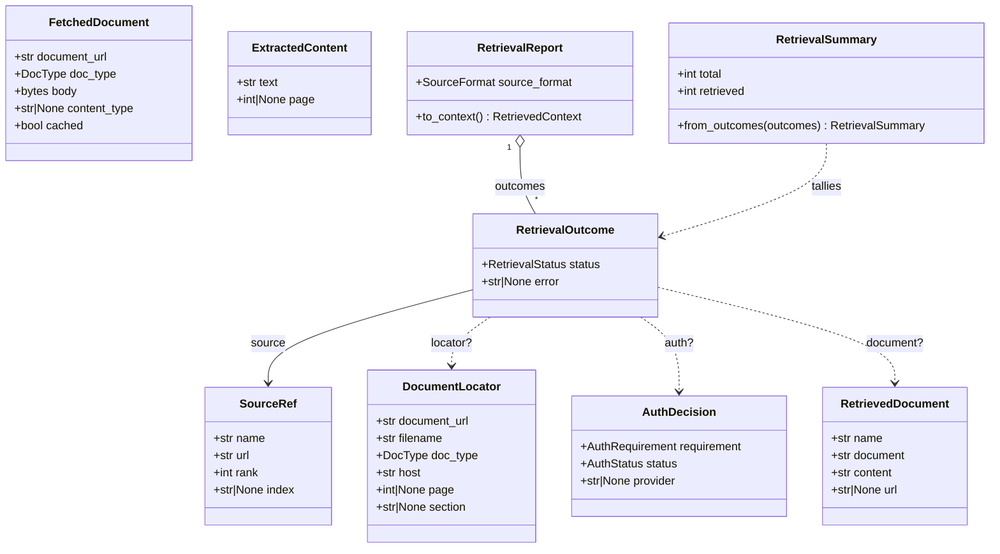
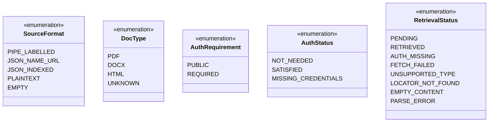
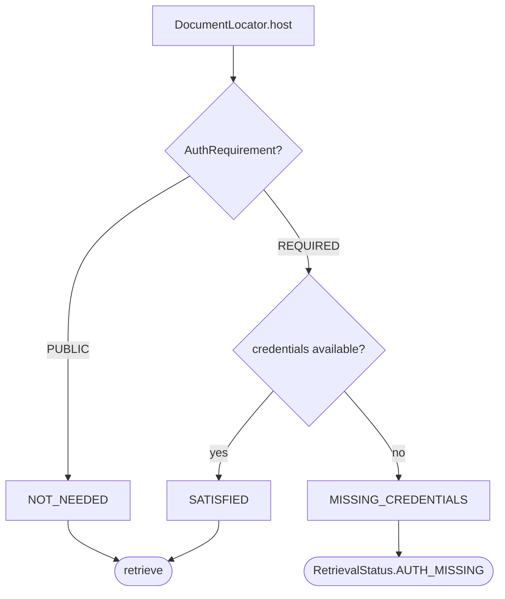
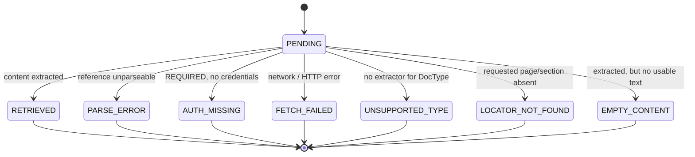

# Retrieval taxonomy

The type system behind the [retrieval pipeline](retrieval-pipeline.md) lives in
`scorekeeper.core.retrieval.types`: the enums, the per-document outcome/status taxonomy, and the
pydantic value objects that flow between stages. This module carries **no** network, PDF,
HTML, or auth logic — its only behaviour is the pure **assemble** helpers
(`ExtractedContent.to_document`, `RetrievalOutcome.assembled`, `RetrievalReport.to_context`)
and `RetrievalSummary.from_outcomes`. The stage *implementations* live behind the `Protocol`
interfaces in `scorekeeper.core.retrieval.protocols`.

Every stage ultimately targets the storage contract in `scorekeeper.core.retrieved_context`:
a `{"documents": [{name, document, content, url}, ...]}` object ordered by retriever rank,
persisted as [`RetrievedDocument`](data-model.md#retrieveddocument) child rows of a turn.

## Value objects

Each pipeline stage emits one value object; a `RetrievalOutcome` threads them together for a
single source reference, and a `RetrievalReport` collects one outcome per reference in a cell.

Which stage produces each value object:

| Value object | Produced by stage | Protocol | Notes |
| --- | --- | --- | --- |
| `SourceRef` | parse | `SourceRefParser` | Ranked reference (label + URL, optional provider `index`). |
| `DocumentLocator` | locate | `DocumentLocatorResolver` | Fetch target: URL minus fragment, filename, `DocType`, host, page/section. |
| `AuthDecision` | authorize | `AuthProvider` | Requirement + resolution against available credentials. |
| `FetchedDocument` | fetch | `DocumentFetcher` | Raw bytes (never persisted); `cached` flags a local-cache hit. |
| `ExtractedContent` | filter + extract | `ContentExtractor` | Markdown for the requested PDF page / whole document (titles, lists, tables; images dropped). |
| `RetrievalOutcome` | assemble | `RetrievalOutcome.assembled` | Builds one reference's terminal outcome from its `ExtractedContent`: `RETRIEVED` with a `RetrievedDocument` (via `ExtractedContent.to_document`), or `EMPTY_CONTENT` when the markdown is blank. |
| `RetrievalReport` | assemble | `RetrievalReport.to_context` | Pure: keeps rank order (duplicates preserved), includes only `RETRIEVED` outcomes with a `document`. |
| `RetrievalSummary` | reporting | `RetrievalSummary.from_outcomes` | Pure per-status tally for `GET /evaluations`. |

## Enums

- **`SourceFormat`** — how the `retrieved_context` cell was encoded; drives the parse
  dispatch (see [Cell formats](retrieval-pipeline.md#cell-formats)). JSON and pipe-labelled
  cells parse deterministically; only `PLAINTEXT` reaches the model.
- **`DocType`** — the kind of document a source URL points at, derived from the filename
  extension (`.pdf`→`PDF`, `.docx`→`DOCX` Word, `.htm`/`.html`→`HTML`); `UNKNOWN` when
  unrecognized (an extensionless page URL, or legacy binary `.doc`).
- **`AuthRequirement` / `AuthStatus`** — see [Authorization](#authorization).
- **`RetrievalStatus`** — the terminal outcome of one reference; see
  [Per-document outcome](#per-document-outcome).

## Authorization

`AuthProvider.classify` maps a document's host onto an `AuthRequirement`, then resolves it
against available credentials into an `AuthStatus`. The three real-world cases:

Credentials come from one of two `AuthProvider` implementations: `HostRuleAuthProvider`
resolves against an injected host → bearer-token map and carries them via `headers`, while
`StoredAuthProvider` reads the `auth_providers` table and carries them via a generic
`AuthClient` (`AuthProvider.client`). A row's `provider` kind selects a `CredentialProvider`
from the registry (`scorekeeper.core.retrieval.credentials`); the concrete **SharePoint** provider
authenticates with an Azure AD client certificate, whose private key is stored encrypted
(per-row salt) and decrypted with `AUTH_ENCRYPTION_KEY` when the client is built. With no
configured row (or no master key), gated documents resolve to `MISSING_CREDENTIALS` →
`AUTH_MISSING`. The credential subsystem is documented in full in
[Retrieval credentials](retrieval-credentials.md).

## Per-document outcome

Each source reference starts `PENDING` and reaches exactly one terminal `RetrievalStatus`:

`RETRIEVED` is the only success — its outcome carries a populated `document` and is the only
status `RetrievalReport.to_context` assembles into the stored context. The failure statuses
carry a short `error` diagnostic. `RetrievalSummary.from_outcomes` tallies these into counts
(`retrieved`, `auth_missing`, `fetch_failed`, `unsupported`, and `other` for the rest).

## Run-level status

While a benchmark run's documents are being retrieved, the run carries the module-level
`STATUS_EN_RECUPERACION` (`"en_recuperacion"`) so `GET /evaluations` can surface the
retrieval phase. Two follow-on rollup states are documented but not yet emitted:
`recuperacion_parcial` (some documents failed) and `recuperacion_fallida` (the phase itself
failed). `evaluation.STATUS_*` and the API serializer adopt these in a later phase.
