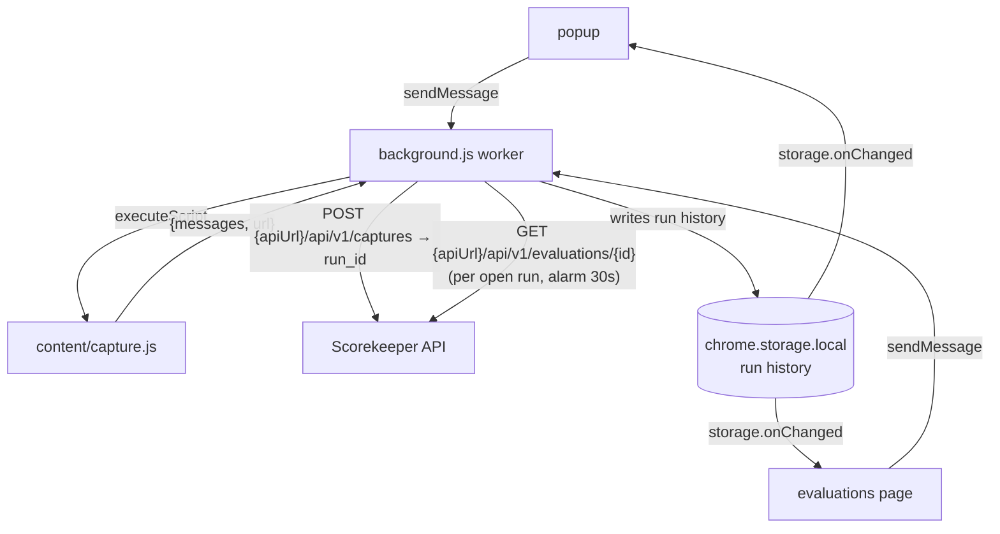

# Scorekeeper Capture (extensión de Chrome)

Captures the conversation open in Copilot, Gemini (consumer or Enterprise), Claude
or ChatGPT and sends it to the Scorekeeper API for scoring — the live-session counterpart to uploading a
conversation `.xlsx`. It is a Manifest V3 extension with no build step and no runtime
dependencies: the folder is loaded as-is, and the files Chrome runs are the files in git.
The `package.json` here is dev-only tooling — lint and tests — never needed to run it.

## Install

1. Start the backend (`docker compose up --build`, or `uv run scorekeeper-api`
   plus a worker). The extension talks to `http://localhost:8001` by default.
2. Open `chrome://extensions` and turn on **Developer mode**.
3. Click **Load unpacked** and pick this `extension/` folder.
4. Optional: pin the extension so its icon stays in the toolbar.

Point it at a different API from the extension's **Ajustes** (options) page. Any
host other than the default needs a permission Chrome only grants from a click,
so the options page asks for it when you save.

## Development

Skip this section to just *use* the extension — none of it is required to load it.

```
npm install         # Biome + Vitest, dev-only
npm run lint        # Biome: lint + format check over src/ and tests/
npm run lint:fix    # ...and apply what it can
npm test            # Vitest over the helpers in src/config.js
npm run package     # dist/scorekeeper-capture.zip — manifest, icons, src, nothing else
```

There is no bundler and there must not be one: `src/content/capture.js` has to reach
Chrome as the classic-script IIFE it is (see below), and every other file is an ES
module the browser loads directly. `npm run package` zips only what ships, so the
tooling never ends up in the Web Store upload.

Tests cover `src/config.js` — the module every surface imports — against an in-memory
`chrome.storage.local` stub. The adapters in `capture.js` are not unit-testable: they
match somebody else's live markup, so the check for those is still opening a real chat.

## Use

1. Open a conversation on a supported chat (see below) and let it finish
   rendering — only what is in the DOM gets captured, so scroll up if the app
   virtualizes long threads.
2. Click the extension icon. The popup reports how many messages it found and
   pre-fills the platform, the model answering (when the chat names it), a scenario
   id (page title + timestamp) and the default use case.
3. Adjust the metadata and press **Enviar a Scorekeeper**.

On a page that is not a supported chat — or a supported chat with no conversation
open — the popup states why instead, and **Enviar a Scorekeeper** stays disabled.

The popup keeps a local history of the runs submitted from this browser. Its
**Última evaluación** panel shows the run for the open chat only — matched on the
chat URL (ignoring `?query` and `#hash`) — and its **Evaluaciones** link opens a
full-page tab listing every run with its live status and a per-row refresh button.
The worker keeps polling every non-terminal run even with both closed, and the
toolbar badge tracks the newest one (`…` running, `✓` done, `!` partial/failed);
once everything has finished successfully the `✓` clears itself after a few
minutes, while a `!` stays until the next capture. Everything else — per-metric
scores, comparisons — is in the API (`GET /runs`) and the dashboard.

## Supported chats

| Adapter | Site | Platform sent | Model detected |
|---|---|---|---|
| `claude` | `claude.ai` | `claude` | yes — the picker under the composer |
| `gemini` | `gemini.google.com` | `gemini` | yes — the mode pill in the header |
| `gemini-business` | `business.gemini.google` (Gemini Enterprise) | `gemini` | yes — the `md-text-button` picker |
| `copilot` | `copilot.microsoft.com`, `m365.cloud.microsoft` | `copilot` | yes — the model switcher by the composer |
| `chatgpt` | `chatgpt.com`, `chat.openai.com` | `chatgpt` | yes — the slug on the answer itself |

The platform is only a default — edit it in the popup before sending if you are
benchmarking under another name. The same goes for the model: see
[Model detection](#model-detection) below.

## How it works



The service worker owns every network call. The popup is destroyed as soon as it
loses focus, so it could not finish an upload it started; delegating also means a
worker request to a host in `host_permissions` skips CORS, so no extra
`CORS_ORIGINS` entry is needed for a locally-run API. Both UI surfaces are pure
readers: they ask the worker to submit or re-poll and re-render off
`storage.onChanged`, so neither owns state that dies when it closes.

`capture.js` is injected on demand rather than declared in the manifest — the
extension only reads a page while you have its popup open (`activeTab`), and has
no standing access to any site.

The same frame gets injected repeatedly: once when the popup opens to preview the
chat, again when you send (the page is re-read so what is scored is the
conversation as it stands at send time). `executeScript` runs the file as a
classic script in the extension's isolated world, and **that world's global scope
survives between injections** — it is only reset when the frame navigates. So
`capture.js` keeps its whole body inside an IIFE and declares nothing at top
level. Unwrap it and capture works exactly once per page load: the second
injection dies on `SyntaxError: Identifier 'ADAPTERS' has already been declared`,
and the popup comes up blank until you reload the page.

The captured turns reach the same database rows as an `.xlsx` upload: the API
normalizes them through `scorekeeper.importer.normalize_messages` and ingests
them with `ingest_evaluation`, so one capture is one `ScenarioResult` with its
`Turn` rows. See [`docs/apis.md`](../docs/apis.md) for `POST /api/v1/captures`.

## Run history & the two surfaces

Every submit appends a run to a single `runs` list in `chrome.storage.local`
(newest first, capped at 25, oldest dropped). Each entry carries what the two UI
surfaces need without another API call: `runId`, `scenarioId`, `platform`, `model`,
`status`, `progress`, per-platform averages, `sourceUrl` (the chat it came from)
and any transient `error`. The helpers that own this shape live in
`src/config.js` (`getRuns`, `getRun`, `upsertRun`); a pre-history single `lastRun`
key is folded into the list once on first read, so upgrading loses nothing.

The worker polls **every** non-terminal run on the 30s alarm and clears the alarm
only once all of them are terminal (`completado`, `parcial`, `fallido`), so
several captures scored at once all keep advancing. A `refresh` message re-polls
one run on demand — behind the popup panel's button and each table row.

The badge reflects the newest run. When all runs are terminal and the newest
succeeded, a second alarm (`CLEAR_BADGE_ALARM`, `CLEAR_BADGE_MINUTES`) wipes the
`✓` after a delay — long enough to notice, so the icon does not carry a stale
green tick indefinitely. It re-checks state when it fires (a capture started in
the meantime cancels it), and a `!` from a partial/failed run is left in place.

Two surfaces read that one store, each re-rendering on `storage.onChanged`:

- **Popup — “Última evaluación”.** Shows the run for the *open chat only*. The run
  is matched by comparing the tab URL to each `sourceUrl` through
  `normalizeChatUrl` (`src/config.js`), which drops `?query` and `#hash`: the
  conversation lives in the path (`claude.ai/chat/<id>`) and a new message never
  changes it, while trackers and scroll anchors do. No match → the panel is
  hidden, keeping another chat's result from showing under this one.
- **Evaluations page** (`src/evaluations/`, opened from the popup's
  **Evaluaciones** link via `chrome.tabs.create`). A full-page tab listing every
  run — scenario, platform, status, progress, average, a link back to the source
  chat, and a per-row refresh for the ones still scoring.

## Maintaining the adapters

The selectors in `src/content/capture.js` are the only part coupled to somebody
else's markup, and these vendors reskin often. Each role lists **candidate
selectors tried in order**, so capture survives a redesign as long as one
candidate still matches, and an obsolete candidate can stay below a new one.

When a platform stops capturing:

1. Open the chat, right-click one message bubble → **Inspect**.
2. Find the element wrapping the whole bubble (the outermost node holding just
   that one message) and note a stable attribute — a `data-testid` or a custom
   element name beats a hashed class.
3. Add it at the **top** of that role's candidate list in the adapter.
4. Reload the extension at `chrome://extensions` and re-open the popup.

Message text is read with `innerText` so code blocks and lists keep their line
breaks; lines that are nothing but interface chrome (`Copiar`, `Retry`, …) are
dropped by the `UI_NOISE` patterns in the same file.

### Model detection

An adapter may declare a `model` selector list — where the app names the model
answering. The first **non-empty** match wins, its first line is kept and its
whitespace collapsed (these pickers stack a chevron and often a subtitle under the
name), and the result is truncated to 128 characters, the width of the
`scenario_results.model_name` column it ends up in.

Alone among the selectors here, `model` resolves against the whole `document` rather
than inside a message bubble: the picker is page furniture next to the composer, not
part of the transcript. That also means it reads the model **currently selected**, so
a thread whose model was switched halfway reports the one in force at capture time.

An adapter may pair `model` with **`modelAttribute`**, and then the name is read from
that attribute rather than from the element's text. Only ChatGPT needs it, because
only ChatGPT records the model without ever printing it: its switcher is an
unlabelled icon button (`aria-label="Switch model"`, no text at all) whose menu is
closed, while every assistant message carries
`data-message-model-slug="gpt-5-6-thinking"`. That inverts the usual trade-off — the
attribute names the model that **actually answered**, not whatever the picker happens
to show now — at the cost of reporting a slug rather than a display name
(`gpt-5-6-thinking`, not "ChatGPT 5.1 Thinking"), which is the more precise of the
two anyway. Since `readModel` takes the first match, a thread whose model changed
halfway reports the one behind its *first* answer.

All five adapters declare one today, but the field stays optional: an adapter whose
picker cannot be read reports `""`, the popup's **Modelo** field comes up empty, and
the API stores `NULL` unless you type one. A blank field is a valid answer — better
than a label that names the wrong thing. Copilot's `.fai-CopilotMessage__name` badge
is exactly that trap: it is the *agent* persona, not the model, which is why it stays
in `chrome` while the model comes off the `#gptModeSwitcher` button by the composer.

**Aim at the element whose text is only the model name**, not at the button around
it. Both Copilot and Gemini Enterprise close their picker with a chevron, and Gemini
Enterprise draws its own as an `md-icon` ligature — the glyph you see is the literal
text `keyboard_arrow_down`, which `innerText` reads back and which would land in the
column verbatim. Hence `.model-selector-label` rather than the label *container* that
also wraps the icon.

To add one: open the chat, right-click the model picker → **Inspect**, note a stable
attribute on the element whose text is just the model name, and put it at the top of
that adapter's `model` list. Same rules as the role selectors — candidates are tried
in order, so an obsolete one can stay below a new one. Prefer an `id` or a
`data-*` attribute over both hashed classes (Copilot's Fluent classes are generated)
and `aria-label` (user-visible text, so it is translated). Where a bare class risks
matching an open dropdown listing every model, scope the first candidate to the
button (`.action-model-selector .model-selector-label`) so the *current* model wins.

### Apps built out of web components

Some chats render entirely inside shadow DOM — Gemini Enterprise puts the whole
conversation behind ~1,200 open shadow roots, two boundaries deep, where plain
`document.querySelectorAll` matches *nothing*. Every selector is therefore
resolved with `deepQueryAll`, one depth-first walk that descends into each
element's `shadowRoot`. On an ordinary page it returns exactly what
`querySelectorAll` would.

A selector still cannot cross a shadow boundary *within itself*: `a b` only
matches when `b` is a light-DOM descendant of `a`. So when the role selector
lands on a wrapper and the text lives one shadow root further in, the adapter
declares a `content` selector list, and the message is read from the first
**non-empty** match inside the bubble (first non-empty, because a component that
streams its markdown may leave empty stand-ins of the same shape beside the real
one). This also drops surrounding furniture for free — a `content` of
`.markdown-document` never sees the copy button, the thinking header or the
feedback footer, because none of them are inside it.

## Layout

| Path | Role |
|---|---|
| `manifest.json` | MV3 manifest: permissions, popup, options, worker. |
| `src/background.js` | Service worker — injection, `POST /api/v1/captures`, polls every open run, badge. |
| `src/config.js` | Shared defaults, run-history + `chrome.storage.local` helpers, chat-URL match, permission request. |
| `src/content/capture.js` | Per-platform adapters; the only DOM-coupled file. |
| `src/popup/` | Capture form and the open chat's evaluation panel. |
| `src/evaluations/` | Full-page tab: the table of every run, with per-row refresh. |
| `src/options/` | API URL, default use case, connection test; persisted per browser. |
| `icons/` | Toolbar and Web Store icons. |
| `package.json` | Dev-only tooling and scripts; ships nothing. |
| `biome.json` | Lint + format config (2 spaces, 100 cols, `chrome` as a global). |
| `tests/` | Vitest over `src/config.js`. |

## Limits

- Only the messages currently in the DOM are captured; a thread the app has
  virtualized away needs scrolling back first.
- Attachments, images and rendered artifacts are not captured — text only.
- `retrieved_context` is captured only where a platform exposes its citations in
  the DOM (today: Microsoft Copilot and Gemini Enterprise — see below). Elsewhere
  it is absent, and the metrics that need it degrade: `hallucination` returns a
  free perfect score and `contextual_precision` a floor of 0, so those scenarios
  are better served by an `.xlsx` upload carrying a context column.
- `expected_output` is never scrapable — a chat UI has no reference answer. Only
  an `.xlsx` upload can supply it.

## Citations → `retrieved_context`

An adapter may declare a `citations` block. What it matches becomes the message's
`retrieved_context`: a JSON array of `{name, url}` records, one element per unique
source (`name` omitted when the source has no title). The backend stores that JSON
in the column and `split_context_docs` renders one retrieved document per element.

```json
[
  {"name": "es.finance.yahoo.com", "url": "https://es.finance.yahoo.com/quote/GMEXICOB.MX/"},
  {"name": "es-us.finanzas.yahoo.com", "url": "https://es-us.finanzas.yahoo.com/quote/SCCO/"}
]
```

`containers` says where the chips are; the rest of the block says how that
platform stores its URLs, and there are two shapes:

| Field | Meaning | Used by |
|---|---|---|
| `json` | a `dataset` key on the chip holding `[{name, url}]` | `copilot` |
| `links` + `label` | selectors for one link per source, plus the attributes to read its name from | `gemini-business` |

For Microsoft Copilot the URLs sit on the inline citation chips as a JSON
`data-grouped-citations` attribute. The visible "Sources" flyout is a dead end —
it stays collapsed until clicked and contains only the word "Sources".

ChatGPT declares no `citations` block, because its chip markup has not been read yet
— the page the adapter was built against holds no web-search answer. Adding one needs
a marker that separates a source chip from a link the model wrote itself: without
that, capture would ground an answer against its own output and score every turn as
perfectly faithful. Until someone inspects a grounded ChatGPT answer and finds such
an attribute, ChatGPT captures carry no `retrieved_context` (see [Limits](#limits)).

Gemini Enterprise instead keeps them in the popover each chip opens, inside the
chip's own shadow root: `a.single-popover-link` when the chip cites one source,
one `md-menu-item` per source once it carries a "+N" badge. Both selectors are
tried on every chip, since one answer mixes the two shapes. The popovers also
carry an excerpt of the retrieved page, deliberately not captured — it runs to
several thousand characters per source and would dominate the judge's prompt.

Only what was actually *retrieved* is recorded, never the sentence a chip is
anchored to: that text is the model's own output, and grounding a response
against itself would score every model as perfectly faithful.

## Chrome inside a bubble

Any adapter may declare a `chrome` selector list for furniture inside a bubble
whose text is not part of the message — accessible headings ("You said:", "Tú
dijiste"), the agent-name badge, the copy/feedback bar, the "may make mistakes"
disclaimer. Lines equal to those elements' text are dropped, so unlike the
wording-based `UI_NOISE` patterns a label can never eat a line of real
conversation that merely resembles it.

Both Microsoft Copilot and Gemini need this. Gemini's labels are Angular CDK
`cdk-visually-hidden` elements — clipped rather than removed from layout, so
`innerText` picks them up and every user turn would otherwise start with "Tú
dijiste". An element `innerText` skips anyway costs nothing here: it contributes
no text, so it removes no lines, which makes a defensive entry safe to add for
furniture that only surfaces on the fallback selectors.
